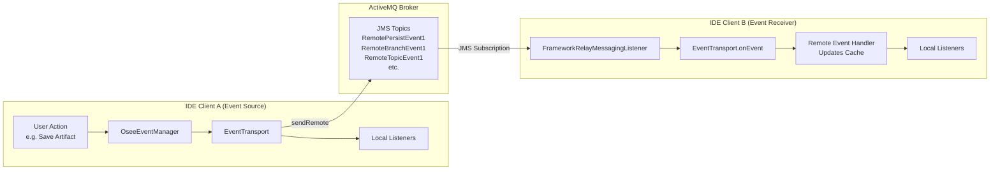
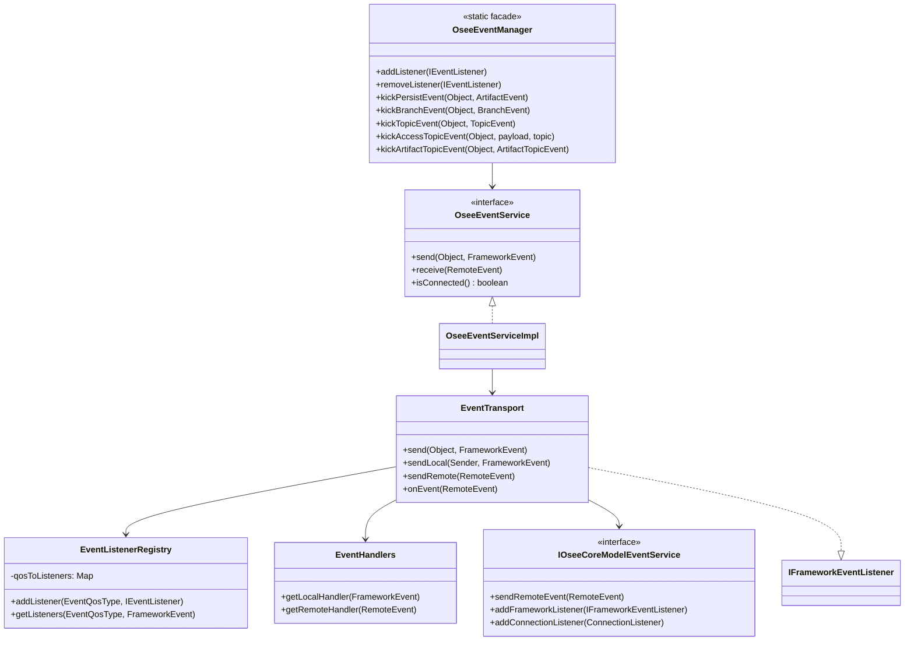
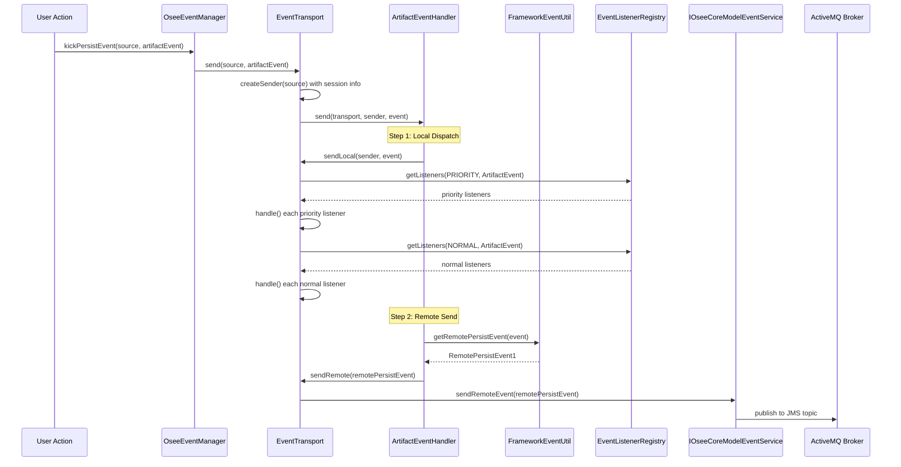
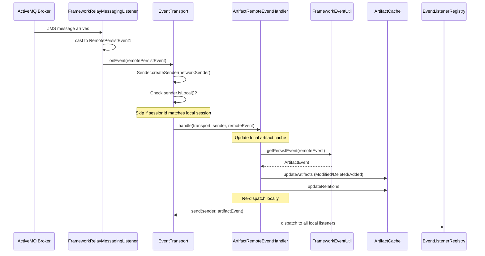
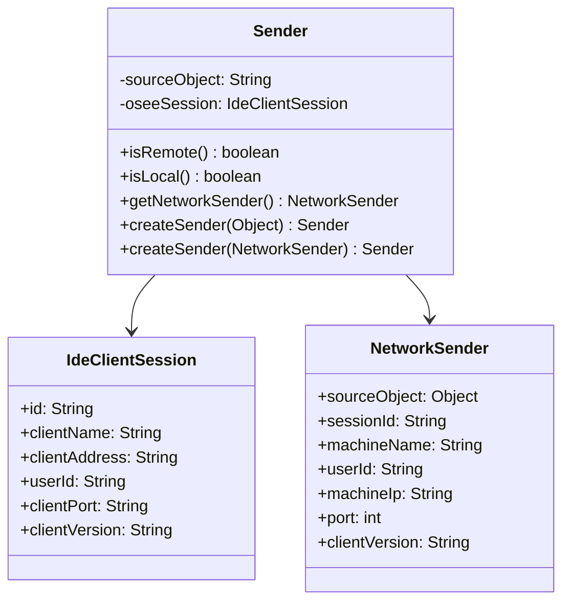
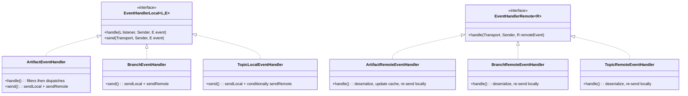
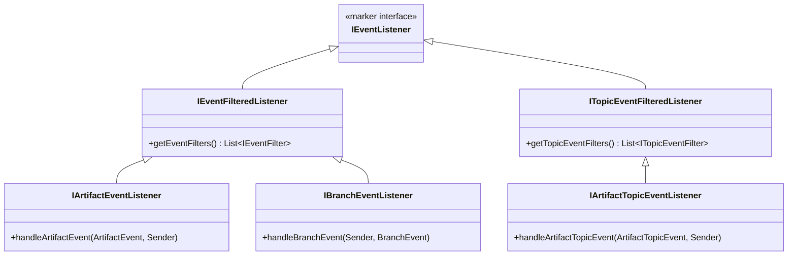
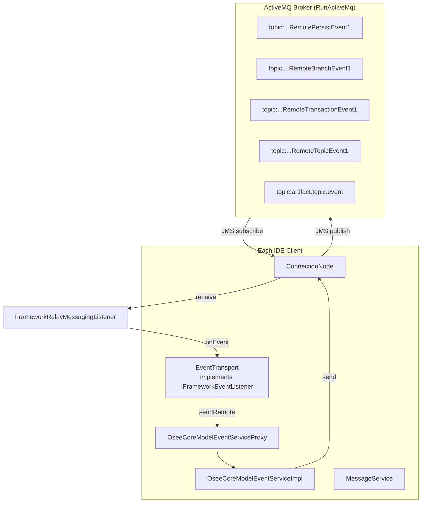
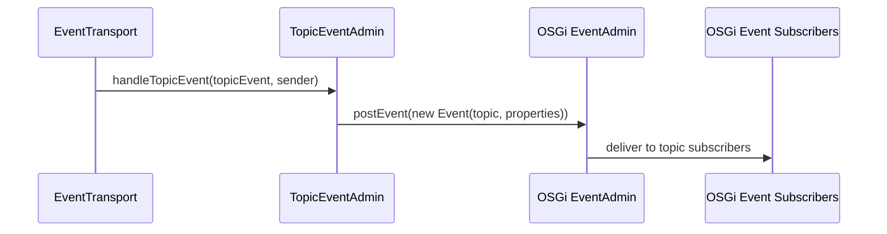

# OSEE Event System Architecture

## Overview

The OSEE Event System provides real-time synchronization of data changes across multiple IDE clients connected to the same OSEE server. When any client persists an artifact change, branch operation, or access control modification, all other connected clients receive notifications and update their local caches accordingly.

The system uses **Apache ActiveMQ** as the message broker, with JMS topics for publish/subscribe communication between clients.

---

## High-Level Event Flow



---

## Component Architecture



---

## Event Types

| Event Class | Purpose | Remote Counterpart | JMS Topic |
|---|---|---|---|
| `ArtifactEvent` | Legacy artifact/relation persist | `RemotePersistEvent1` | `topic:...RemotePersistEvent1` |
| `ArtifactTopicEvent` | New JSON-based artifact persist | `RemoteArtifactTopicEvent` | `topic:artifact.topic.event` |
| `BranchEvent` | Branch create/delete/commit/purge | `RemoteBranchEvent1` | `topic:...RemoteBranchEvent1` |
| `TransactionEvent` | Transaction deleted/purged | `RemoteTransactionEvent1` | `topic:...RemoteTransactionEvent1` |
| `TopicEvent` | Generic topic with properties | `RemoteTopicEvent1` | `topic:...RemoteTopicEvent1` |
| `AccessTopicEvent` | Access control changes | (via TopicEvent) | (via RemoteTopicEvent1) |

---

## Detailed Sequence: Local Artifact Persist → Remote Notification



---

## Detailed Sequence: Remote Event Reception



---

## Sender Identity & Local vs Remote Detection

The `Sender` class is critical for preventing event echo (a client receiving its own event back). It wraps an `IdeClientSession` containing:



**`isRemote()` logic:** Compares the sender's `sessionId` against `ClientSessionManager.getSession().getId()`. If they differ, the event originated from another client.

---

## Event Handler Architecture



Each `EventHandlerLocal.send()` follows the same pattern:
1. If dispatch-to-local is allowed → `sendLocal()` (iterate listeners)
2. If sender is local AND event is not reload-only → `sendRemote()` (serialize + JMS publish)

---

## Event Listener Interfaces



### Event Filters

Listeners provide filters via `getEventFilters()`:
- **`BranchIdEventFilter`** — only passes events matching a specific branch
- **`ArtifactTypeEventFilter`** — only passes events for specific artifact types
- Filters check: branch match → artifact match → relation artifact match

---

## Messaging Layer (JMS/ActiveMQ Integration)



### ResMessages Enum (JMS Topic Registry)

```java
RemoteBranchEvent1       → "topic:org.eclipse.osee.coverage.msgs.RemoteBranchEvent1"
RemoteBroadcastEvent1    → "topic:org.eclipse.osee.coverage.msgs.RemoteBroadcastEvent1"
RemotePersistEvent1      → "topic:org.eclipse.osee.coverage.msgs.RemotePersistEvent1"
RemoteTopicEvent1        → "topic:org.eclipse.osee.coverage.msgs.RemoteTopicEvent1"
RemoteTransactionEvent1  → "topic:org.eclipse.osee.coverage.msgs.RemoteTransactionEvent1"
RemoteTopicArtifactEvent → "topic:artifact.topic.event"
```

---

## Serialization: FrameworkEventUtil

`FrameworkEventUtil` converts between local event objects and their remote (wire-format) counterparts:

| Local Event | → Remote (send) | ← Remote (receive) |
|---|---|---|
| `ArtifactEvent` | `getRemotePersistEvent()` → `RemotePersistEvent1` | `getPersistEvent()` ← `RemotePersistEvent1` |
| `ArtifactTopicEvent` | `getRemotePersistTopicEvent()` → `RemoteArtifactTopicEvent` | `getPersistTopicEvent()` ← `RemoteArtifactTopicEvent` |
| `BranchEvent` | `getRemoteBranchEvent()` → `RemoteBranchEvent1` | `getBranchEvent()` ← `RemoteBranchEvent1` |
| `TransactionEvent` | `getRemoteTransactionEvent()` → `RemoteTransactionEvent1` | `getTransactionEvent()` ← `RemoteTransactionEvent1` |
| `TopicEvent` | `getRemoteTopicEvent()` → `RemoteTopicEvent1` | `getTopicEvent()` ← `RemoteTopicEvent1` |

### Legacy vs New Event System

OSEE maintains two parallel event paths:
- **Legacy**: `ArtifactEvent` → JAXB-serialized `RemotePersistEvent1` (individual artifact/relation/attribute records)
- **New (Topic)**: `ArtifactTopicEvent` → JSON-serialized `RemoteArtifactTopicEvent` (properties map with JSON payloads)

The `FrameworkEventUtil.USE_NEW_EVENTS` flag controls which path is used.

---

## Access Control Events

Access events use the generic `TopicEvent` mechanism with predefined topics:

```java
AccessTopicEvent.ACCESS_ARTIFACT_MODIFIED  → "framework/access/artifact/modified"  (LocalAndRemote)
AccessTopicEvent.ACCESS_ARTIFACT_LOCK_MODIFIED → "framework/access/artifact/lock/modified" (LocalAndRemote)
AccessTopicEvent.ACCESS_BRANCH_MODIFIED    → "framework/access/branch/modified"    (LocalAndRemote)
AccessTopicEvent.USER_AUTHENTICATED        → "framework/access/user/authenticated" (LocalOnly)
```

These flow through `OseeEventManager.kickAccessTopicEvent()` → `TopicEvent` → `TopicLocalEventHandler` → OSGi `EventAdmin.postEvent()` for local OSGi subscribers, and optionally via `RemoteTopicEvent1` to other clients.

---

## OSGi EventAdmin Bridge

The `TopicEventAdmin` class bridges OSEE's event system to OSGi's `EventAdmin`:



This allows any OSGi component to subscribe to OSEE events via standard OSGi event topics without depending on the OSEE event listener interfaces.

---

## EventQosType (Quality of Service)

```java
enum EventQosType {
    PRIORITY,  // Delivered first — used by caches that must update before UI listeners
    NORMAL     // Standard delivery order
}
```

Priority listeners (e.g., `ArtifactCache`) are registered via `OseeEventManager.addPriorityListener()` to ensure caches are current before UI components query them.

---

## Remote Event Loopback (Testing)

The `EventSystemPreferences.isEnableRemoteEventLoopback()` flag enables a testing mode where:
1. Events sent to `sendRemote()` are also fed back into `onEvent()` with a new session ID
2. This simulates multi-client scenarios in a single JVM
3. Normal operation: local events skip `onEvent()` processing (detected via `sender.isLocal()`)

---

## Cache Update on Remote Events

When a remote `ArtifactEvent` arrives, `ArtifactRemoteEventHandler` updates the local in-memory artifact model:

| Modification Type | Cache Action |
|---|---|
| **Added** | Nothing (not in cache; will be loaded on demand) |
| **Modified** | Update attributes: load new data, reset dirty flags, update gamma IDs |
| **Deleted/Purged** | Mark artifact as deleted (`internalSetDeletedFromRemoteEvent()`) |
| **ChangeType** | Update artifact type reference |
| **Relation Added** | Create new `RelationLink` in the artifact's relation set |
| **Relation Deleted** | Mark `RelationLink` as deleted |

---

## Plugin Structure

| Plugin | Responsibility |
|---|---|
| `org.eclipse.osee.framework.skynet.core` | Event manager, transport, handlers, listeners, filters |
| `org.eclipse.osee.framework.messaging.event.res` | Remote event message types, JMS integration, relay listeners |
| `org.eclipse.osee.framework.messaging` | Abstract messaging layer (ConnectionNode, MessageService) |
| `org.eclipse.osee.framework.core` | Core event types (NetworkSender, FrameworkEvent, TopicEvent) |
| `org.eclipse.osee.framework.core.client` | Access topic events, client session management |
| `jms.activemq.launch` | ActiveMQ broker embedded launcher |

---

## Summary

The OSEE event system is a publish/subscribe architecture where:
1. **Local changes** are dispatched synchronously to in-process listeners (filtered by branch/type)
2. **Remote notification** serializes the event and publishes it to an ActiveMQ JMS topic
3. **Remote reception** deserializes, updates the local artifact cache, then re-dispatches to local listeners as a "remote" event
4. **Echo prevention** uses session ID comparison to ignore self-originated events
5. **Two parallel systems** (legacy JAXB + new JSON) coexist for backward compatibility
