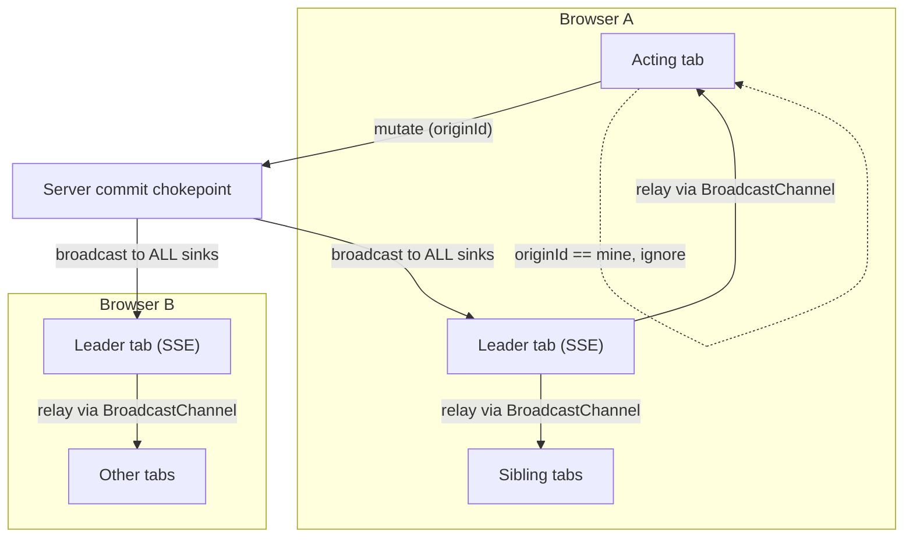
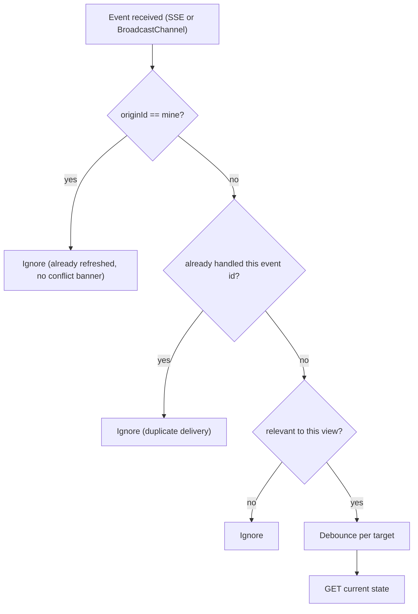
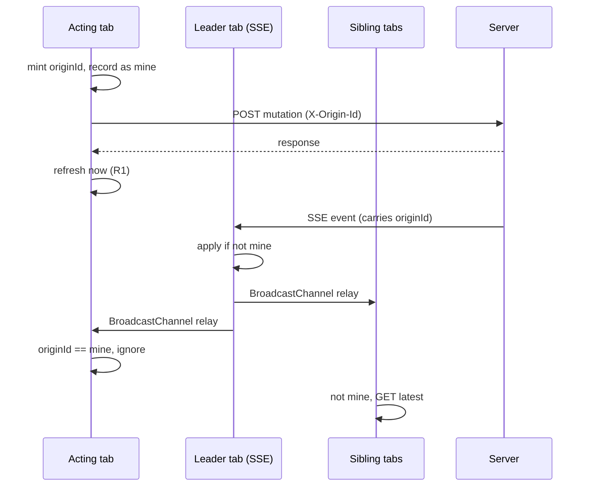
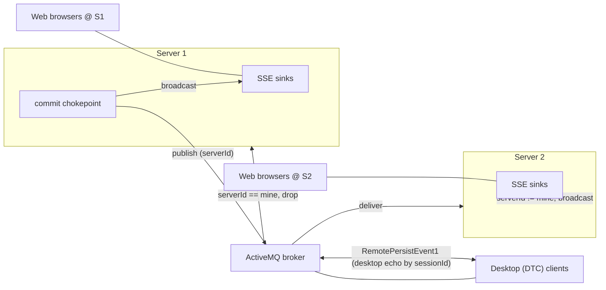

# Real-Time Change Propagation & Presence (SSE)

Single source of truth for the web client's real-time system: how data changes propagate to all
connected clients (web tabs, multiple browsers/machines, multiple users, desktop DTC clients, and
multiple servers), plus presence ("who is viewing what"). This document consolidates the transport
decision, the target architecture, presence, the `associatedUsers` relevance mechanism, the desktop
(ActiveMQ) bridge, reconnect/resync, local multi-server testing, and the durable requirements.

Related feature docs: `docs/ai/web/conflict-resolution.md` (attribute conflict resolution built on
this system), `docs/ai/web/actra.md` (ACTRA consumers), and `docs/ai/desktop/client-event-system.md`
(the desktop RCP event/cache subsystem the ActiveMQ bridge integrates with).

## Transport choice: SSE vs WebSocket

**SSE** (Server-Sent Events) is a browser-native API (`EventSource`) letting a server push events
to the client over a standard HTTP connection: the client opens a long-lived request, the server
streams events using `text/event-stream`.

| Aspect | SSE | WebSocket |
|--------|-----|-----------|
| Direction | Server -> Client only | Bidirectional |
| Security | Same as REST (cookies, Authorization headers, HTTPS pass through automatically) | Separate auth handling during the upgrade handshake |
| Per-message overhead | Slightly more (HTTP chunked headers, ~30 bytes) | Slightly less (binary framing, ~6 bytes) |
| Reconnection | Client uses `@microsoft/fetch-event-source` with custom backoff+jitter and give-up/recovery | Must be implemented manually |
| Proxy/LB compatibility | Better -- plain HTTP through any chunked-transfer proxy; standard HTTP load balancers | Worse -- some proxies/LBs mishandle the HTTP->WS upgrade; needs sticky sessions or WS-aware LB |
| Server dependencies | Zero new -- works with existing JAX-RS/CXF | Requires Jetty WebSocket bundles (not in the target platform) |
| Browser support | All modern (native `EventSource`) | All modern (native `WebSocket`) |

**Decision: use SSE.** The artifact-change use case is inherently unidirectional (server detects a
commit -> pushes a notification -> client refreshes the affected data; the client sends saves via
REST, never through the notification channel). SSE is simpler, needs no new dependencies, is equally
secure/efficient for low-frequency ~100-byte JSON payloads, and avoids proxy/LB upgrade problems. If
bidirectional communication is ever needed (real-time cursors, collaborative editing), WebSocket can
be added later without changing the consuming components.

**Why not upgrade to EE10 for `jakarta.websocket`?** That is an EE8 (`javax.*`) -> EE10 (`jakarta.*`)
migration touching every REST endpoint, servlet, MANIFEST import, plus CXF 3.6.x -> 4.x and Jackson/
Swagger/library upgrades -- thousands of changes across hundreds of files, weeks of effort plus full
server regression. Not warranted for notifications. Plan the `javax` -> `jakarta` migration as a
separate, dedicated effort when the ecosystem forces it (CXF 3.x EOL, or Eclipse Platform dropping
EE8).

## Principles

1. **Server-driven propagation.** All notification is decided server-side; clients never choose
   recipients or exclude anyone. Transactions ride one unconditional chokepoint
   (`TransactionCommitTopic`, fired by every `TransactionBuilder.commit()`); non-transactional
   changes (branch, etc.) use a small enumerable set of explicit broadcast points. A new committing
   endpoint is correct with zero extra wiring.

2. **Broadcast to all, no exclusion.** Every change goes to every connection; recipients
   self-filter. Removes the racy per-user/per-connection exclusion and presence-lease machinery.

3. **Actor refreshes from its own response; SSE is for other clients.** The acting tab refreshes
   from its own HTTP mutation response -- never from the SSE echo (dropped by `originId`
   self-recognition). Other tabs/browsers/users refresh via SSE.
   - *Continuity:* one user action -> one continuous visual transition; no dependence on a slow/
     unreliable cross-server relay hop, no double-load flicker.
   - *Maintenance:* the local-refresh trigger is driven by **one centralized client chokepoint**,
     `MutationService` (`web/apps/osee/src/app/shared/services/network/mutation.service.ts`), via
     `mutateAndNotify(httpCall, describeChange)` or the pipeable `withLocalNotify(describeChange)`
     operator. `describeChange` returns a typed `changeDescriptor`
     (`{ type: 'artifact', branchId, artifactIds, transactionId, changeTypes }` or
     `{ type: 'branch', branchId, changeType }`) or `null`. On success the chokepoint calls
     `emitLocalChange` on the artifact or branch notification service. It is the single emit site;
     `TransactionService.performMutation`, `ActionService.transitionAction`, and branch ops all
     route through it.
   - *Industry norm:* React Query, Apollo, Replicache all update the actor from the mutation
     response and use broadcast/push only for other clients.

4. **GET-on-notify.** Recipients fetch current DB state rather than applying event deltas.
   Self-correcting and order-independent: a stale/out-of-order notification just triggers a GET that
   returns latest truth, so no freshness/ordering key is required for correctness.

5. **Origin-ID echo dedup at two scopes.** Tab ID (acting tab ignores its own echo, and suppresses
   false "changed by someone else" conflict banners) and server ID (origin server ignores its own
   cross-server echo from ActiveMQ). Client-minted IDs are known *before* the request is sent, so
   recognition is order-independent (no echo-beats-response race); state is bounded.

6. **Leader tab = transport only.** Only the leader holds the single SSE connection (elected via Web
   Locks) and rebroadcasts received events to sibling tabs via BroadcastChannel. Leadership decides
   who *relays*, not who *refreshes*.

7. **Coalesce, don't order.** Recipients debounce rapid notifications per target and GET latest.
   `BranchChangeEventService.branchChanges$` coalesces per `(branchId, changeType)` within a short
   window (a DTC delete = setState + archive arriving on both the SSE topic path and the desktop-
   bridge relay collapses to one emission per type). It keeps the **richest** event in the window
   (prefer one carrying `associatedArtifactId`, not simply the last).

8. **`originId` is request-scoped ambient context, captured only at broadcast points.** The client
   mints a per-tab `originId` and sends it on every request as `X-Origin-Id`. A server edge filter
   stores it in a request-scoped `ThreadLocal` (`OriginContext`); it is read only at the small set
   of broadcast capture points, always on the request thread, then carried in the event payload
   across thread/server boundaries.
   - The explicit-parameter alternative does not scale (dozens of `createTransaction(...)` call
     sites, most internal). Ambient context keeps intermediate layers (ATS, ORCS) ignorant. Capture
     surface is tiny and all on the request thread: `TxCallableFactory.postCommitEvent` (every
     committing path) and `BranchEndpointImpl` (branch ops).
   - *Not MDC/ScopedValue/ContainerRequestContext:* MDC is a logging facility (semantic misuse);
     `ScopedValue` is preview-gated in Java 21; `ContainerRequestContext` properties aren't readable
     from ORCS. A ~15-line owned `OriginContext` holder behind `set/get/clear` has no new dependency
     and can be swapped for `ScopedValue` later in one file.
   - *Thread-pool hygiene:* `AuthenticationRequestFilter` sets it on entry (a missing/empty header
     calls `set(null)` = clear) and `AuthenticationResponseFilter` calls `OriginContext.clear()` on
     exit, mirroring `removeUserFromCurrentThread()`. Every JAX-RS request starts and ends clean, so
     a value cannot leak onto a pooled thread.

## Overview & connection architecture

Three event categories flow over the same SSE connection:
- **Artifact changes** -- transaction commits (attribute edits, creates, deletes, relations).
  Optionally carries `associatedUsers` (user references from changed user-valued attributes) and
  `changedAttributeTypeIds` (which attribute types changed) so views decide relevance / do targeted
  refreshes client-side.
- **Branch changes** -- branch metadata modifications (commit, rename, archive, state/type,
  delete/purge, rebaselined).
- **Presence updates** -- who is viewing what context.

```
Per user (regardless of tab count):
  1 SSE connection (held by "leader" tab, elected via Web Locks)
  1 BroadcastChannel ('osee-sse') for distributing events to follower tabs
  1 BroadcastChannel ('osee-presence') for presence context coordination

Leader tab: holds the SSE connection; receives events, rebroadcasts to followers.
            If it closes/crashes, the lock auto-releases and the next tab becomes leader.
Follower tabs: receive events from BroadcastChannel (no direct server connection).
```

## Deliberately removed vs. an earlier exclusion-based model

- All server-side exclusion: per-user `getSinkIdForUser`, per-connection `X-SSE-Connection-Id`, the
  `excludeSinkId` parameter on `OseeSseEndpoint.broadcast`. `broadcast(eventName, json)` sends to
  every sink; self-dedup is by `originId` on the message.
- Presence-lease routing/exclusion on **both** broadcast paths (the cross-server relay no longer
  gates on `hasWatchersForBranch`, which lagged the SSE connection and made a just-reconnected peer
  client miss events). The presence subsystem (heartbeat/leave/reaper in `PresenceRegistry`) remains
  for *presence updates* but is **not** used for change routing.
- Dedicated cross-tab local broadcast of the acting tab's own change (siblings get it via the
  leader's SSE-echo rebroadcast).
- txId-based freshness dedup (kept only as a dormant extension point).
- Debug instrumentation.

The `/health/ready` readiness gate (see Reconnect & resync) is a behavioral can-commit probe used
only to time reconnect transitions, not for recipient selection or exclusion.

## Architecture

### Event flow (single server, web)



### Per-event decision (any tab)



### Acting-tab sequence (leader or follower)



### Topology / network view



### Two ActiveMQ channels -- distinct audiences, no overlap

Both channels ride ActiveMQ but carry different message types for different audiences; neither
feeds the other, so there is no cross-channel loop:

- **Web-cluster bus (S2S):** `ServerToServerEvent` (lightweight JSON), published by
  `ServerToServerEventPublisher`, consumed by peer `ServerToServerEventListener`s. Carries **all**
  cross-server web change types -- `artifact_changed`, `branch_changed`, `branch_rebaselined`, and
  `presence` -- tagged with the per-JVM `serverId`. A peer fans out an SSE notification to its local
  web clients and **never re-publishes**. This is the only web<->web cross-server path.
  (`presence` carries a server's per-context user set; the peer merges it into its local presence.)
- **Desktop bus:** `RemotePersistEvent1` / `RemoteBranchEvent1` (heavy JAXB records), handled by
  `ActiveMqSseBridge`. This is web<->**desktop** only: web changes are translated to desktop events
  for DTC cache updates, and desktop changes are relayed to local web SSE. Its `SERVER_SOURCE_ID`
  sender guard drops web-originated events echoed back off the broker, so the desktop bus does
  **not** carry web<->web (the S2S bus does).

Why two: the desktop event is the wrong shape/weight for web (deltas for a local cache vs. a
notification for GET-on-notify), and the desktop bus deliberately refuses web<->web. The S2S bus is
the single, purpose-built web-cluster notification channel. Publish sources: artifact events are
published from the `TransactionCommitTopic` handler; branch events are published from the branch
broadcast path via a relay hook (`SseBroadcastService.CrossServerBranchRelay`) that
`ServerToServerEventPublisher` registers -- branch changes are not on `TransactionCommitTopic`.

Echo prevention: S2S drops by per-JVM `serverId` (unique per server); the desktop bus drops by
`SERVER_SOURCE_ID` (the shared "a web server sent this" marker). `originId` is carried across the
S2S hop so a client whose originating tab is on a *different* server still ignores its own echo.

Shared string vocabularies (no scattered literals): the S2S event-type discriminator is
`ServerToServerEvent.ARTIFACT_CHANGED` / `BRANCH_CHANGED` / `BRANCH_REBASELINED` / `PRESENCE`; the
branch change-type values (`created`, `committed`, `renamed`, `archived`, `unarchived`,
`state_changed`, `type_changed`, `deleted`, `purged`, `rebaselined`) are defined once in
`WebBranchChangeType` (an enum in `org.eclipse.osee.framework.core.event`, so both the `orcs.core`
producer and the `orcs.rest` consumers reference one source) and referenced by every
producer/consumer (`OrcsBranchImpl`, `SseBranchChangeHandler`, `BranchEndpointImpl`,
`SseBroadcastService`, `ServerToServerEventPublisher`, `ActiveMqSseBridge`). Each constant carries
its wire string via `getWebValue()`; `fromWebValue()` is the reverse lookup. **Client contract:**
those wire values must stay in sync with the `branchChangeType` union in `sse-event.service.ts`.

### Branch-event vocabulary

The web branch vocabulary is the **actionable** subset of the desktop `BranchEventType`, mapped 1:1
by `BranchEventGuids` in `ActiveMqSseBridge` (both directions). All web types are **terminal** -- the
web is notification-only (GET-on-notify), so the desktop's transient/in-progress markers
(`Committing`/`Deleting`/`Purging`/`CommitFailed`) are deliberately **not** web types and are not
relayed (nothing to fetch mid-operation).

| Web type (`WebBranchChangeType`) | DTC `BranchEventType` | Web consumer use |
|---|---|---|
| `created` | `ADDED` | Refresh branch lists/selectors (a new branch appeared). |
| `committed` | `COMMITTED` | Refresh current-branch views; close artifact-explorer tabs on the source branch. |
| `renamed` | `RENAMED` | Refresh name in lists and current-branch views. |
| `archived` | `ARCHIVE_STATE_UPDATED` | Refresh lists (archived usually hidden). |
| `unarchived` | `ARCHIVE_STATE_UPDATED` | Refresh lists. |
| `state_changed` | `STATE_UPDATED` | Re-GET current branch state. |
| `type_changed` | `TYPE_UPDATED` | Refresh lists/type (e.g. WORKING<->BASELINE). |
| `deleted` | `DELETED` | Remove from lists; **close tabs / navigate away** -- do not re-GET (404s). |
| `purged` | `PURGED` | Same as `deleted` (branch physically gone). |
| `rebaselined` | (web-specific; carries `newBranchId`) | Re-point views old->new working branch. |

`created`/`deleted`/`purged`/`renamed`/`archived`/`unarchived`/`type_changed`/`rebaselined` are
**list-affecting** -- `BranchChangeEventService.listAffectingChanges$` emits on them so branch
lists/selectors refresh reactively even for a branch the consumer is not already watching by id.

## Dedup scopes

| Scope | Key | Minted by | Prevents |
|---|---|---|---|
| Tab (within / across browsers) | `originId` | client, before send | acting tab re-refreshing its own echo; false conflict banners |
| Server (across servers) | `serverId` | server (per JVM) | origin server replaying its own cross-server echo |
| Delivery (same tab) | event id | server | duplicate delivery (reconnect replay, transport loopback) |

## Topology coverage

| Topology | Behavior |
|---|---|
| Same user, same browser, multi-tab | acting tab refreshes now; leader relays SSE echo to siblings; acting tab ignores its own by `originId` |
| Same user, different browsers/machines | each browser's leader gets the SSE broadcast; acting browser's acting tab already refreshed; its echo is ignored, other browsers GET latest |
| Different users (web) | all leaders get the broadcast; only the acting tab ignores (its `originId`); everyone else GETs |
| Web + DTC | web change -> `ActiveMqSseBridge` -> `RemotePersistEvent1`/`RemoteBranchEvent1` on ActiveMQ -> DTC cache update; DTC change -> bridge -> local SSE broadcast; web GETs (never originated it) |
| Multi-server (web cluster) | origin server broadcasts locally + publishes a lightweight `ServerToServerEvent` (artifact **or** branch, tagged per-JVM `serverId`) on the S2S bus; each peer rebroadcasts unconditionally to its local SSE sinks (which self-filter), preserving `originId`; origin drops its own echo by `serverId`; peers never re-publish (no loop) |
| Leadership handoff | affects only who holds SSE / relays; refresh logic and `originId` dedup are leadership-independent |

## Client implementation: shared dedup primitive

Self-echo drop, duplicate-delivery suppression, optional per-key debounce, and local emit are
implemented once in a reusable primitive, `OriginAwareEventStream<T>`
(`web/apps/osee/src/app/shared/services/network/origin-aware-event-stream.ts`), rather than
duplicated per event family. Both `ArtifactChangeNotificationService` and `BranchChangeEventService`
compose it:

| Config | Artifact events | Branch events |
|---|---|---|
| `myOriginId` | `OriginIdService.originId` | `OriginIdService.originId` |
| `getOriginId` | `inv.originId` | `event.originId` |
| `getEventKey` | `branchId/artifactId/transactionId` | -- (none) |
| `suppressDuplicates` | true | **false** (no stable per-event id; GET is idempotent) |
| `debounceMs` | 0 (opt-in extension point) | 0 |

- `next(event)` feeds raw SSE events in; `output` is the filtered stream consumers subscribe to;
  `emitLocal(event)` injects the acting tab's own change immediately (R1), bypassing the filters;
  `reset()` clears duplicate-suppression state on SSE reconnect.
- The output is `share()`d and kept hot by the service, so the filters run exactly once regardless
  of subscriber count.
- Debounce (principle 7) is a per-stream config flag (`debounceMs`), currently 0 everywhere; enable
  it if a redundant-GET problem is measured.
- **Field initialization order:** `_localEmissions` must be declared before the constructor, because
  `build()` (called from the constructor) merges it. If declared after, it is `undefined` at merge
  time and every `emitLocal` is silently dropped.

## Reconnect & resync

Only the leader tab holds the SSE connection; reconnect logic lives in `SseEventService`.

- **Backoff with full jitter, capped.** `onerror` returns `random(0, min(base * 2^(n-1), 30s))`
  (base 1s). Jitter avoids thundering-herd reconnects. `onclose` throws (fetch-event-source treats a
  normal stream-end as terminal) so a server restart routes through the same backoff.
- **Time-based give-up.** After `RECONNECT_GIVE_UP_WINDOW_MS` (60s) of *continuous* failure the
  leader pauses, sets `disconnected` (red), and arms three recovery triggers: `online`,
  `visibilitychange`, and a periodic timer (`RECONNECT_PERIODIC_RETRY_MS`, 45s) so recovery does not
  depend on a DOM edge firing (covers sleep/resume, degraded-but-not-offline). The backoff delay is
  clamped so the next retry -- and thus the give-up check, which only runs inside `onerror` -- lands
  no later than the deadline.
- **401/403 is distinct from transport failure.** An auth-status open is parked
  (`handleAuthExpired`) and not retried via backoff -- a dead session can't be healed by reopening
  the socket.

### Readiness gate (server-warmup)

A reopened socket does **not** immediately go `connected`. The socket can open before the server can
serve data (ORCS/ATS/user/type subsystems still warming after a restart); writing or resyncing in
that window causes transient 500s and phantom conflicts.

- On a successful open, `onOpenSuccess` stays `connecting` and polls `GET /health/ready`
  (`HealthEndpointImpl.getReadiness`) with backoff. Only on 200 does it go `connected`, set
  `serverReady`, and fire resync. The readiness phase has its own give-up window (a socket that
  stays open but never ready still transitions to `disconnected`).
- **`/health/ready` checks can-commit, not can-read**: branch query resolves *and* user resolves
  *and* artifact types loaded. A read-only probe greens too early. Authenticated (not on the
  `AuthenticationRequestFilter` exception list); minimal `{ready}` body (no topology leak).
- The readiness poll generation (`readinessPollId`) cancels superseded polls; `markNotReady` clears
  the `serverReady` flag on transient socket errors **without** cancelling the poll loop (cancelling
  there orphaned the poll if the socket recovered without a fresh `onopen`).

### Save gating & deferred save

- `serverReady` gates mutations: `MutationService.mutateAndNotify` rejects while not ready
  (defense-in-depth), and save affordances (workflow editor button) disable with a tooltip.
- **Auto-save-on-blur components defer, not lose.** The persisted-attribute editor's blur-save is
  rejected while not ready but the edit stays dirty/pending; an effect watching `serverReady`
  flushes it on reconnect (skipped when `conflicted`, so a diverged server state still routes through
  the conflict dialog rather than clobbering).

### Resync fan-out to followers

- On a successful re-open following a prior connection, the leader fires `connectionReestablished$`
  locally **and** broadcasts a `reestablished` channel message so every follower resyncs too.
  Coalesced within `RESYNC_COALESCE_WINDOW_MS` (3s) so a flapping reconnect fires once.
  `browserWasConnected` (tracked per tab from observed `connected` state) makes this fire after a
  leadership handoff, not only on the original leader.
- **Consumers refresh on resync.** GET-on-notify has no notify for events missed during the gap, so
  open views re-fetch on reconnect. `ArtifactChangeNotificationService` and
  `BranchChangeEventService` expose `resync$`; the dedup stream is `reset()`, and consumers (artifact
  editor, Actra world, Actra workflow editor, hierarchy, current-branch-info) merge `resync$` into
  their refetch trigger. Refetch pipelines wrap the GET in bounded `retry` + `catchError` so a
  transient warmup failure never escapes into `toSignal`/change detection. The global error popup is
  muted for `RESYNC_ERROR_MUTE_MS` (15s) around resync.

### Manual reconnect

The connection badge offers a **Reconnect** action while `disconnected`. `reconnectNow()` re-fetches
auth (`UserDataAccountService.refresh` -- a failed startup cached the invalid-user sentinel), then
reopens as leader or asks the existing leader to reconnect. `resolveUserThenLead` retries auth with
backoff (up to the give-up window) if it resolves to the sentinel, so a server that comes up shortly
after the button press is picked up.

### Auth resilience (storm fix)

`UserDataAccountService.user` is `refresh`-triggered, `catchError`-to-invalid-user-sentinel, then
`shareReplay(refCount:false)`. On error `shareReplay` does **not** cache -- it re-runs the source per
new subscriber, which with eager consumers + the auth interceptor produced an infinite request storm
on `/orcs/datastore/user` when the server was down. Completing with a value (sentinel `id '-1'`) and
replaying it removes the storm; a new attempt happens only on `refresh()`. Consumers gate on the
sentinel (SSE connect filters `id !== '-1'`; the profile dropdown shows "Not Signed In"). A global
`ErrorHandler` (`global-error-handler.ts`) routes any uncaught error to the error popup so a stray
throw can't abort change detection and leave CDK overlays mispositioned.

### Server-to-server marshalling (JAXB)

`JAXBUtil` (framework.messaging) pins the thread-context classloader to its own bundle around JAXB
marshal/unmarshal. `jakarta.xml.bind.JAXB` discovers its runtime via a TCCL `ServiceLoader` lookup
and caches the result on first use; if the first marshal ran on the OSGi EventAdmin thread (whose
TCCL can't see `org.glassfish.jaxb.runtime`) the failure was cached for the JVM lifetime, breaking
all cross-server event publishing after a restart-with-reconnect. Pinning the TCCL makes discovery
deterministic regardless of the calling thread.

## Transactional vs non-transactional

- **Transactional** (artifact/attribute/relation): one chokepoint (`TransactionCommitTopic`). Its
  handler publishes the artifact `ServerToServerEvent` cross-server.
- **Branch create/state/type/rename/archive/unarchive/delete/commit/purge:** one ORCS-layer
  chokepoint -- `OrcsBranchImpl` fires a `BranchChangeTopic` (OSGi EventAdmin) from each mutation,
  carrying `originId` captured synchronously from `OriginContext`. `SseBranchChangeHandler` (in
  `orcs.rest`) subscribes and drives the single `SseBroadcastService` fan-out. Because every path
  (REST, ATS, MIM, internal) converges on `OrcsBranchImpl` -- create on `createBranch`, commit/purge
  via the returned callables wrapped to fire on success -- all of them notify uniformly. This is the
  branch analogue of `TransactionCommitTopic` for artifacts, and it removed the per-endpoint
  broadcasts that left the ATS create/commit paths silent.
- **Only `rebaselined` remains imperative** (`BranchEndpointImpl.updateBranchFromParent` via
  `SseBroadcastService.broadcastBranchRebaselined`): it is a web-specific synthesized swap with a
  `newBranchId`, produced by a single endpoint with no bypass risk and no single ORCS verb.
- All branch broadcasts carry `originId`, broadcast to all, GET-on-notify. They use identical client
  handling and reach peer web servers through the S2S bus (never the desktop bus).

## Branch mutations (create / delete / purge / commit / ...)

Every branch mutation is broadcast from the `OrcsBranchImpl` chokepoint via `BranchChangeTopic`.
Previously these were broadcast only from `BranchEndpointImpl`, so paths that reach ORCS by another
route -- notably ATS create (`/ats/config/branch` -> `orcsApi.getBranchOps().createBranch`) and ATS
commit (`AtsBranchCommitOperation` -> `branchOps.commitBranch`) -- were silent. Highlights:

- **create** -- `OrcsBranchImpl.createBranch`, the funnel all create paths route through (including
  `/ats/config/branch` create-working-branch-for-action), broadcasts `created`. Web consumers refresh
  branch lists/selectors via `listAffectingChanges$`. The event carries `associatedArtifactId` (the
  branch's `associated_art_id`, already on the loaded `Branch` -- no extra query), so a consumer that
  can't yet key on the new branch id (e.g. the ATS workflow editor awaiting a branch created *for its
  artifact*) matches on it precisely instead of refetching on every create. Mirrors the desktop,
  which resolves the same id receiver-side via `BranchManager.getAssociatedArtifactId(branch)` (the
  web has no branch cache, so the server carries it). Also carried on `state_changed`/`deleted`
  (branch loaded there too); absent on the id-only verbs and on desktop-relayed events.
- **delete** -- `OrcsBranchImpl.setBranchState` broadcasts `deleted` when the new state is `DELETED`
  (and `deleteBranch` broadcasts `deleted` for the composite delete path).
- **purge** -- `OrcsBranchImpl.purgeBranch`'s callable broadcasts `purged` on success.

`deleted` and `purged` are kept **distinct from `state_changed`** on purpose: the branch is gone, so
a re-GET would 404. Distinct types let the client act instead of re-fetching, and preserve the DTC's
targeted decache (which also distinguishes them).

Web consumers of `deleted`/`purged`:
- **Artifact-explorer tabs** -- `ArtifactExplorerTabService.removeTabsByBranchId` closes any tabs on
  the gone branch (mirrors the rebaseline re-point block, but there is no successor to re-point to).
  The same handler also closes tabs on `committed` -- a committed working branch is no longer a live
  editing target. This one `branchChanges$` subscription replaced the legacy
  `BranchCommitEventService` (now removed), so commit/delete/purge tab-cleanup all ride the single
  SSE branch-event path.
- **Selected branch / hierarchy** -- `SelectedBranchLifecycleService` watches the selected branch
  and, on `deleted`/`purged` for it, shows a snackbar naming the gone branch and navigates to
  `COMMON_BRANCH_ID` via `BranchRoutedUIService` (updates the URL query param too, so the dead id
  doesn't linger and re-trigger a 404 on the next nav sync).

**Selected-branch reactions are centralized.** `SelectedBranchLifecycleService` (root-provided, one
`initialize()` from `AppComponent`) owns every app-level reaction to the *currently selected* branch
becoming invalid, driven by a declarative reaction table keyed by `branchChangeType` -- each entry
supplies optional `navigateTo` and/or `notify` (snackbar) effects. Today: `rebaselined` (re-point to
successor), `deleted`/`purged` (navigate to COMMON + notice). A new selected-branch case is one table
entry, not another subscription. Scope is the *selected* branch only (keyed on `uiService.id`);
per-tab reactions (closing tabs on a deleted branch) stay in `ArtifactExplorerTabService`, keyed on
each tab's own branch.

The web has no delete/purge **UI** -- these are received events. The create-from-workflow flow is the
one web create path: the button routes through the `MutationService` chokepoint (server-ready gated)
to emit a local `created` branch notification, also emits a local artifact change on the workflow's
associated artifact (COMMON branch) so an open workflow editor refetches immediately, then opens the
artifact explorer on the new working branch via query params
(`/ple/artifact/explorer?branchId=...&branchType=working`) -- not a `working/<id>` path segment,
which has no route and 404s.

## Rebaselined working branches (update-from-parent)

Update-from-parent is a **branch swap**, not an in-place update: the server creates a new working
branch, re-associates the artifact, and deletes/rebaselines the original. **The working branch id
changes** (verified in `BranchEndpointImpl.updateBranchFromParent` -- the original is set to
`DELETED`/`REBASELINED` and a `newBranchId` takes over the name + associated artifact).

To let consumers follow the swap, the branch change event carries the transition:

- `changeType: 'rebaselined'`, `branchId` = the **old** (retired) id, `newBranchId` = the id going
  forward. Two fields, no `associatedArtifactId` -- consumers key on the old id they already hold.
- Server: `SseBroadcastService.broadcastBranchRebaselined(old, new, userId, originId)`, called from
  both terminal success paths in `updateBranchFromParent`. Broadcast to local SSE and published on
  the S2S bus (`branch_rebaselined`) so peer web servers' clients follow the swap. **Not** relayed to
  the desktop bus -- desktop derives the swap from its own granular Renamed/StateUpdated/Deleted
  events, so a synthetic rebaselined relay would double-notify it.
- Client: `BranchChangeEventService.forRebaseline(oldBranchId)`.

Consumers that follow the swap:
- **Workflow editor** -- its refetch trigger includes `forBranch(workingBranchId)`; a `rebaselined`
  event triggers a refetch, which re-derives the new working branch.
- **Artifact-editor tabs** -- `ArtifactExplorerTabService` re-points any tab from the old branch to
  `newBranchId`; the editor's `branchId` computed recomputes and the resource re-fetches.
- **Hierarchy + selected-branch views** -- `SelectedBranchLifecycleService` re-points `uiService.id`
  to `newBranchId` when the selected branch is rebaselined, cascading to all selected-branch
  consumers.

Known limitation: a **desktop-initiated** rebaseline reaches web as the underlying granular events
(state_changed/archived), not a single `rebaselined` (the DTC<->web bridge can't correlate the
separate desktop operations into one swap). Web-initiated rebaseline is fully handled.

## Gotchas / traps (learned the hard way)

- **Local-emit descriptors must carry the artifact id, not a token object.** The acting tab refreshes
  only if the emitted `artifactId` matches what its `forArtifact(branchId, artifactId)` subscription
  keys on (the same value the SSE echo carries). A transition's `workItemIds` are `ArtifactToken`
  **objects** (`{ id, name }`); `String(token)` yields `"[object Object]"`, which matches nothing ->
  acting tab silently never refreshes (while other tabs, fed by the SSE echo with correct numeric
  ids, do). Always map tokens to `.id` in `describeChange`.
- **`originId` is deliberately per-tab, not per-browser/group.** This localizes the blast radius of
  any local-emit bug to the single acting tab -- siblings are covered by SSE regardless. A
  group-scoped originId would make the whole browser suppress its own echo, so a local-emit bug would
  blind every tab. Do not "optimize" originId to group scope.
- **Sibling tabs refresh via the leader's SSE-echo relay, not a local cross-tab broadcast.** This is
  one delivery path (simpler) at the cost of siblings lagging the acting tab by ~one SSE round-trip.
  If sibling latency ever matters, add a cross-tab local broadcast deduped by event key (benign
  double-GET on mismatch) -- not a group-scoped originId.

## Angular services (transport & buses)

### `SseEventService` (`@osee/shared/services/network`)

Transport layer. Manages the SSE connection with leader election.

| Member | Purpose |
|--------|---------|
| `connect()` | Joins the leader group (only leader opens SSE) |
| `disconnect()` | Leaves the group |
| `artifactChanges$` | Observable of artifact change events (from SSE or BroadcastChannel). Carries `associatedUsers` for relevance filtering. |
| `branchChanges$` | Observable of branch change events |
| `presenceUpdates$` | Observable of presence update events |
| `connectionState` | Signal: `'disconnected' \| 'connecting' \| 'connected'` |
| `sseConnectionId` | Server-assigned SSE connection/sink ID (used by presence as the sink id -- **not** for change-propagation exclusion, which was removed) |
| `connectionReestablished$` | Emits on reconnect (leader and followers) so consumers reset dedup and re-GET open views |

### `ArtifactChangeNotificationService` (`@osee/shared/services`)

Artifact-specific notification bus. Local + remote changes flow through the same stream (composes
`OriginAwareEventStream`).

| Method | Purpose |
|--------|---------|
| `initialize()` | Starts SSE (called once from AppComponent) |
| `emitLocalChange(branchId, artifactIds, txId, changeTypes, associatedUsers?, changedAttributeTypeIds?)` | Local change (from the `MutationService` chokepoint) |
| `resync$` | Emits on reconnect; consumers merge into their refetch trigger to re-GET after a missed-event window |
| `artifactInvalidations$` | All changes (local `isLocal: true` + remote) |
| `forArtifact(branchId, artifactId)` | Filtered to one artifact |
| `forBranch(branchId)` | Filtered to branch |
| `structuralChangesForBranch(branchId)` | Create/delete/relation only |
| `forChangedAttributeType(branchId, typeId)` | Changes whose `changedAttributeTypeIds` include `typeId` (targeted refresh, e.g. Name) |

### `BranchChangeEventService` (`@osee/shared/services`)

Branch-specific notification bus (composes `OriginAwareEventStream`).

| Method | Purpose |
|--------|---------|
| `initialize()` | Subscribes to branch events (called from AppComponent) |
| `emitLocalChange(branchId, changeType)` | Local branch change (from the `MutationService` chokepoint) |
| `branchChanges$` | All branch change events (coalesced per `(branchId, changeType)`) |
| `forBranch(branchId)` | Filtered to a specific branch |
| `forRebaseline(oldBranchId)` | Emits the `rebaselined` swap for a branch |
| `listAffectingChanges$` | Emits on list-affecting types (created/deleted/purged/renamed/archived/unarchived/type_changed/rebaselined) |

### `UserPresenceService` (`@osee/shared/services`)

Lease-based, leader-aggregated context-aware presence.

| Method | Purpose |
|--------|---------|
| `watchContext(contextKey: Signal<string>, destroyRef)` | Returns `presenceHandle` with `users` signal |

Architecture:
- **Presence leadership IS SSE-connection leadership.** There is no separate presence-leader Web
  Lock; the presence leader is whichever tab holds the SSE connection (`SseEventService.isConnectionLeader`).
  That tab owns the authoritative live `sinkId`, so it is the only tab that can heartbeat/leave
  without carrying a stale or mirrored sinkId. `UserPresenceService` reacts to `isConnectionLeader`
  (and `serverReady`) via an effect: on gaining leadership it seeds sibling-tab contexts
  (`request-announce`) and starts the heartbeat loop; on losing it (handoff) it stops, so it never
  keeps asserting a connection it no longer owns.
- **`UserPresenceService` is constructed in EVERY tab** via `initialize()` from the app root (like
  the sibling event services), NOT lazily by presence-watching components. This is essential: the
  SSE leader may be on a page that watches no context (e.g. the ACTRA world page). If the service
  only existed on presence-watching pages, such a leader would have no presence service to receive
  other tabs' announces or heartbeat their contexts -- presence would silently not work.
- Each tab reports its contexts to the leader via BroadcastChannel `announce`. The leader
  aggregates every tab's contexts (its own + all followers, across pages) into `allTabContexts`
  (`Map<tabId, Set<context>>`) and sends ONE heartbeat POST every 15s with the union.
- **Reconciliation / self-heal:** every heartbeat tick the leader broadcasts `request-announce`, so
  all live tabs re-announce. This rebuilds the aggregate from the live tabs each interval, so a lost
  announce or a wrongly-pruned entry recovers within one tick rather than being stuck. Recording an
  unchanged re-announce returns "no change", so these re-announces do NOT trigger a heartbeat
  (avoids a duplicate heartbeat each tick).
- **Prune (departed tabs):** each tick the leader queries `WebLocksService.queryActiveLockNames()`
  (per-tab locks that are `held` OR `pending`) and drops any `allTabContexts` entry whose per-tab
  lock is absent -- the browser releases a tab's lock the instant it dies. Pending is included so a
  just-starting tab is never misread as gone. There is NO staleness/last-seen eviction: presence
  only runs when Web Locks are available (SSE leadership requires them), and a live-but-quiet tab
  must never be dropped. A genuinely wedged tab is reaped server-side by the lease TTL.
- **Idle gate:** if the aggregate is empty the leader skips the POST -- EXCEPT the single
  non-empty->empty transition (last watcher left), which is sent so the server clears the leases. So
  a leader on a page nobody watches stays silent on the wire, and reconciliation still runs so it
  resumes instantly when a watcher appears.
- Immediate heartbeats (debounced 500ms) on a real context change for responsive UX.
- The leader never heartbeats with a null/non-numeric `sinkId` (it skips until its connection id is
  established), so the server never stores an undeliverable, un-leaveable null-sink lease.
- Server leases expire after 45s without renewal (crash detection).
- On `pagehide`, the leader sends an authenticated keepalive `fetch` `leave` reporting its SSE
  connection's `sinkId`, so presence clears promptly. `keepalive: true` lets the request survive
  the unloading page; the SSE auth headers are set explicitly (the raw fetch bypasses the Angular
  interceptor). Best-effort -- the lease TTL is the backstop. There is no server-side SSE
  connection-close callback in the CXF stack, so this explicit client signal is the prompt path.
- A heartbeat whose `sinkId` differs from the stored lease (reconnect/leadership handoff)
  re-broadcasts the context roster to the new connection, so a rejoining tab sees existing users.

### `PresenceAvatarsComponent` (`@osee/shared/components`)

Reusable UI component: `<osee-presence-avatars [users]="handle.users()" />`
- Overlapping avatar circles with user initials.
- Max 3 visible, "+N" overflow with tooltip listing remaining names.
- Handles single-name, multi-name, empty-name users.

## Event payloads

```typescript
type artifactChangeEvent = {
  branchId: string;
  artifactIds: string[];
  transactionId: string;
  userId?: string;
  changeTypes?: artifactChangeType[];
  // User references from changed user-valued attributes, grouped by attribute type.
  // Lets views decide relevance client-side (e.g. Actra "My World").
  associatedUsers?: associatedUsers[];
  // Distinct attribute type ids changed in the transaction. Lets views do targeted
  // refreshes (e.g. a hierarchy label only on a Name change) instead of reacting to
  // every attribute_modified.
  changedAttributeTypeIds?: string[];
  // Client-minted id of the originating tab (echoed by the server); the originating tab
  // ignores its own echo.
  originId?: string;
};

type associatedUsers = {
  typeId: string;              // source attribute type id
  encoding: 'artId' | 'userId';
  userIds: string[];
};

type branchChangeEvent = {
  branchId: string;
  changeType: branchChangeType;
  userId?: string;
  newBranchId?: string;         // rebaselined only
  associatedArtifactId?: string; // created/state_changed/deleted (when branch loaded)
  originId?: string;
};

type presenceUpdate = {
  context: string;
  users: presenceUser[];
};

type presenceUser = {
  userId: string;
  userName: string;
};
```

## Server side (Java)

### Key classes

| Class | Location | Role |
|-------|----------|------|
| `OseeSseEndpoint` | `orcs.rest/internal/ws/` | Thin SSE transport: sink registry, `events`/`presence/heartbeat`/`presence/leave` endpoints, `broadcast()`. Delegates all presence state to `PresenceRegistry` |
| `PresenceRegistry` | `orcs.rest/internal/ws/` | Owns presence: local leases + peer-reported presence, context indexes, reaper, cross-server merge + relay hook. One per JVM |
| `SseBroadcastService` | `orcs.rest/internal/ws/` | Static utility for broadcasting artifact + branch events; exposes `BranchChangeRelay`/`CrossServerBranchRelay` hooks |
| `SseTransactionCommitHandler` | `orcs.rest/internal/ws/` | OSGi EventHandler on commit topic -> broadcasts SSE notifications (incl. `associatedUsers`) |
| `SseBranchChangeHandler` | `orcs.rest/internal/ws/` | OSGi EventHandler on `BranchChangeTopic` -> the single SSE+S2S+desktop fan-out for branch changes |
| `ActiveMqSseBridge` | `orcs.rest/internal/ws/` | Desktop<->Web bridge via ActiveMQ; also builds `associatedUsers` for relayed desktop persist events via the token service |
| `ServerToServerEventPublisher` | `orcs.rest/internal/ws/` | Multi-server: publishes lightweight S2S events to ActiveMQ |
| `ServerToServerEventListener` | `orcs.rest/internal/ws/` | Multi-server: receives S2S events, relays to local SSE unconditionally (no presence gate) |
| `TransactionEndpointImpl` | `orcs.rest/internal/` | Commits the transaction; SSE broadcast is fired by `SseTransactionCommitHandler` off the commit topic (not inline) |
| `BranchEndpointImpl` | `orcs.rest/internal/` | Branch REST ops; only `rebaselined` is broadcast here (imperative). Others broadcast from the ORCS chokepoint |
| `OrcsBranchImpl` | `orcs.core/internal/` | Single branch chokepoint: fires `BranchChangeTopic` on every branch mutation (carries `originId` + `associatedArtifactId` when the `Branch` is loaded) |
| `TxCallableFactory` | `orcs.core/internal/transaction/` | Fires `TransactionCommitTopic` after commit (branchId, transactionId, artifactIds, artifactTypeIds, associatedUsers, changedAttributeTypeIds, **originId** from `OriginContext`) |
| `OriginContext` | `framework.core/event/` | Request-scoped holder for the client `originId`; set by `AuthenticationRequestFilter`, read at broadcast points (tx + branch) |
| `TransactionCommitTopic` | `framework.core/event/` | OSGi EventAdmin topic + property constants for artifact commits (incl. `ORIGIN_ID`) |
| `BranchChangeTopic` | `framework.core/event/` | OSGi EventAdmin topic + property constants for branch changes (incl. `ORIGIN_ID`, `ASSOCIATED_ARTIFACT_ID`) |
| `WebBranchChangeType` | `framework.core/event/` | Enum of web branch change-type wire values; shared by `orcs.core` producer and `orcs.rest` consumers |
| `AuthenticationRequestFilter` | `orcs.rest/` | Sets `OriginContext` from `X-Origin-Id`. `/orcs/sse/presence/leave` is authenticated (NOT on the exception list): the leave carries the SSE auth headers and its removal is scoped to the authenticated user |
| `HealthEndpointImpl` | `orcs.rest/internal/` | `/health/ready` can-commit readiness probe used to time reconnect transitions |

### CXF/SSE threading note

CXF clears thread-local user context for SSE async handlers. `orcsApi.userService().getUser()`
returns invalid in `subscribe()`. User identity is resolved in the `heartbeat` POST endpoint where
auth works reliably.

### Presence server design

`PresenceRegistry` owns all presence state (one instance per JVM); `OseeSseEndpoint` is a thin
transport that delegates to it and supplies a `LocalPresenceNotifier` for SSE delivery.

- Local leases keyed by `userId::context` in a `ConcurrentHashMap`; context indexes
  (`context -> leaseKeys`) keep per-context lookups proportional to that context, not the whole map.
- `POST /presence/heartbeat` -- reconciles: creates/renews listed contexts, removes unlisted ones for
  that user.
- `POST /presence/leave` -- authenticated; removes the caller's leases on the reported `sinkId`
  (`dropSinkForUser`, scoped to the authenticated user so a guessed sinkId can't evict anyone
  else). Sent by the leader's keepalive fetch on unload.
- Background reaper thread (every 15s) -- expires local leases older than 45s (and stale peer
  presence).
- `presenceUpdate` SSE event sent to local sinks with leases in affected contexts.

**Cross-server presence.** Presence is per-JVM, so a user on server A must be shown to a user on
server B. Each local presence change publishes this server's users for the context to peers over the
S2S bus (`ServerToServerEvent.PRESENCE`); a peer stores it in a per-`(peerServerId, context)` map
with its own TTL and merges it (deduped by userId) into what it broadcasts to its local clients.

- **Loop prevention:** locally-originated changes broadcast to local sinks AND publish to peers;
  peer-originated changes (and remote expiry) broadcast to local sinks only.
- **TTL renewal:** every heartbeat re-publishes this server's presence for all of the user's contexts
  (not just changed ones), resetting the peers' 60s remote-presence TTL so a steady viewer never ages
  out cross-server; the TTL still clears a crashed/silent peer.
- **Peer key (`SERVER_ID`):** `ServerToServerEventPublisher.SERVER_ID` (`computeServerId()`) is
  `host:<org.osgi.service.http.port>` -- the HTTP port THIS server binds. It must be both **unique
  per instance** (the S2S listener drops any event whose `originServerId` equals its own `SERVER_ID`
  as an echo, so two servers sharing an id silently discard each other's presence) and **stable
  across restarts** (peers key a server's contribution by this id, so a restart re-keys to the same
  id instead of orphaning ghosts until the 60s TTL). Do NOT derive it from `OseeClient.getPort()`:
  that reads the client-facing `osee.application.server` property, commonly unset on the server, so
  every instance would share one id and cross-server presence would silently stop. Falls back to a
  random UUID only if host/port can't be resolved.
- **Resync on (re)connect:** a one-shot leave relayed while the bus was down is lost (unlike live
  presence, which self-heals via the every-15s republish). So `PresenceRegistry.resyncPresenceToPeers()`
  re-publishes all local presence when the relay registers and on every bus reconnect (a
  `ConnectionListener.connected` on the S2S `ConnectionNode`), so peers repopulate promptly instead
  of waiting on TTL.
- The S2S relay is a hook (`PresenceRegistry.CrossServerPresenceRelay`) registered by
  `ServerToServerEventPublisher`, so `PresenceRegistry` has no JMS dependency.

## Cross-client event system (ActiveMQ) -- desktop bridge

Desktop Eclipse clients and web clients see each other's changes via ActiveMQ as the cross-process
transport.

```
Desktop Client commits -> direct DB write -> sends RemotePersistEvent1 to ActiveMQ
    v
Server's ActiveMqSseBridge.onEvent() receives it
    -> Extracts numeric artId, maps modType to web change types
    -> Broadcasts via SSE to web clients (notification + pull model)

Web Client commits -> POST /orcs/txs -> TxCallableFactory -> EventAdmin event
    v
ActiveMqSseBridge.handleEvent() receives EventAdmin event
    -> Builds RemotePersistEvent1 with artId + artTypeGuid
    -> Sends to ActiveMQ -> desktop clients receive and update cache

Multi-Server:
    ServerToServerEventPublisher.handleEvent() -> lightweight JSON to S2S ActiveMQ topic
    ServerToServerEventListener receives on other server -> broadcasts SSE locally (unconditional)
```

### Branch events (cross-client)

Branch metadata changes (commit, rename, archive/unarchive, state/type change, delete/purge) bridge
both ways, using `RemoteBranchEvent1` on ActiveMQ and the `branchChanged` SSE event:

```
Desktop branch op -> RemoteBranchEvent1 on ActiveMQ
    v
ActiveMqSseBridge.onEvent() -> maps BranchEventType GUID -> web changeType -> SSE branchChanged
    (skips events whose sender is this server, i.e. its own web->desktop relay echoed back)

Web branch op -> OrcsBranchImpl -> BranchChangeTopic -> SseBranchChangeHandler -> SseBroadcastService
    -> SSE branchChanged to web clients
    -> BranchChangeRelay hook -> ActiveMqSseBridge publishes RemoteBranchEvent1 to ActiveMQ
```

The relay hook (`SseBroadcastService.BranchChangeRelay`, registered by the bridge in `@Activate`)
keeps the SSE utility free of any JMS dependency. Desktop-originated branch changes are re-broadcast
to SSE via `broadcastBranchChangeFromRemoteClient()`, which deliberately does **not** re-invoke the
relay, preventing an echo back onto ActiveMQ. The branch event type GUIDs are a single source of
truth in `framework.core.event.BranchEventGuids`, referenced by both the client `BranchEventType`
enum (skynet.core) and the server bridge (orcs.rest).

### ActiveMQ configuration

- Server launch: `-Dosee.default.broker.uri=vm:(broker:(tcp://localhost:61616)?persistent=false)?marshal=false`
- Client launch: `-Dosee.default.broker.uri=tcp://localhost:61616`
- Production: `-Dosee.default.broker.uri=tcp://<broker-host>:61616`

## Associated users & relevance-based refresh (Actra `/world`)

The Actra `/world` view lists the current user's work items (assigned, originated, subscribed). It
must refresh when a change concerns the user, but not on every ATS-branch change system-wide. Rather
than compute recipients on the server and target specific SSE sinks, the `artifactChanged` event is
**broadcast to all clients** and carries enough data for each client to decide relevance locally --
with **no extra server query** and no bespoke SSE machinery.

**`associatedUsers` on the artifact-change event.** When a transaction changes a user-valued
attribute, the event carries the user id(s) it now references, grouped by attribute type:

```
associatedUsers: [ { typeId: "1902418199157448550", encoding: "artId", userIds: ["3333"] }, ... ]
```

This is populated **generically** from attribute types marked with a user-reference `DisplayHint`
(`UserArtId` or `UserId`) -- the marker lives on the attribute type in whatever bundle defines it
(ATS, MIM, core, future), so the producers stay domain-agnostic:
- **Web path:** `TxCallableFactory` already iterates the dirty attributes; it reads the value of any
  user-reference-marked attribute (zero extra query) and adds it to `associatedUsers`.
- **Desktop path:** `ActiveMqSseBridge` reads the same from the relayed `RemotePersistEvent1`'s
  attribute changes, resolving each attribute type via the token service to check the marker.

**Client decides relevance.** `ActraWorldComponent` refreshes only when a change on the ATS branch is
relevant to the current user, which is a purely local check:
- **Newly associated** -- the user id appears in `associatedUsers` (art-id encoded), e.g. a workflow
  just assigned to them -> row appears.
- **Already in my list** -- a changed artifact id matches a row currently displayed (each world row
  carries a stable `id`) -> covers reassignment *away* and state changes -> row drops/updates.

Everything else is ignored, so unrelated workflow changes never trigger a refresh.

Why this design:
- **No server query.** `associatedUsers` is forwarded from data already in the commit/relay; the
  removed-assignee (drop-off) case is handled entirely by the client's own list membership.
- **Reusable.** Any future "does this concern me?" feature (my reviews, watched items) uses the same
  generic `associatedUsers` + attribute-type filter. Cross-domain safe because entries are tagged by
  their source attribute type -- consumers only react to the type ids they care about.
- **Domain-neutral producers.** `orcs.core`/`orcs.rest` read a core `DisplayHint` marker; no ATS or
  MIM knowledge leaks into them. The marker is the single source of truth, on the type.
- **No bespoke SSE path.** No world-specific topic, event, or per-user sink targeting -- just one
  optional field on the existing `artifactChanged` event.

**Opting a new attribute in (any domain).** To have an attribute contribute to `associatedUsers`,
mark its type -- where it is declared (`CoreAttributeTypes`, `AtsAttributeTypes`, MIM tokens, ...) --
with the core `DisplayHint`:
- `DisplayHint.UserArtId` -- the stored value is a user **artifact id** (what `/world` matches on).
- `DisplayHint.UserId` -- the stored value is a user **userId string**.

Example: `ats.Current State Assignee` is declared `..., Read, UserArtId`. No SSE/event code changes
are needed -- both producers read the marker generically.

### Targeted refresh via `changedAttributeTypeIds`

A parallel, domain-neutral relevance mechanism: the `artifactChanged` event carries the distinct
attribute type ids changed in the transaction (`changedAttributeTypeIds`), so a view can refresh only
when an attribute type it cares about changed, instead of on every `attribute_modified`.

- **Producers** mirror `associatedUsers` exactly: `TxCallableFactory` collects the ids from the dirty
  attributes it already iterates (web path); `ActiveMqSseBridge` collects them from the relayed
  `RemotePersistEvent1` attribute changes (desktop path); `ServerToServerEvent` carries them across
  servers. No extra query.
- **Consumers** use `ArtifactChangeNotificationService.forChangedAttributeType(branchId, typeId)`
  (mirrors `forAssociatedUser`), or read `inv.changedAttributeTypeIds` off any invalidation.
- **Local path:** the acting tab populates it itself from the transaction body's attribute `typeId`s
  (`TransactionService.deriveChangedAttributeTypeIds`), so it does not wait for the server echo.
  (Deleted attributes carry only an instance id in the body, so the local path omits them; the remote
  echo -- derived from the actually-dirty attributes -- covers that case.)

Motivating example -- **artifact hierarchy tree label on rename.** The hierarchy tree
(`ArtifactHierarchyComponent`) refetches its lightweight children on structural changes
(`structuralChangesForBranch`), which deliberately excludes `attribute_modified` so it does not
refetch the whole tree on every attribute edit anywhere on the branch. But a **Name** change is the
one attribute edit that affects a node's displayed label. So the tree adds a second trigger:
`forChangedAttributeType(branch, ATTRIBUTETYPEIDENUM.NAME)`, scoped to the artifact ids currently
shown at that level, to refetch the label when a visible node's Name changes -- local or remote --
without a whole-branch refetch storm.

## Consuming changes in components

### Artifact editor (parent-driven reload + delete handling)

Subscribe to the **pre-filtered** `forArtifact(branchId, artifactId)` stream (not the app-wide
`artifactInvalidations$` with a manual id check) so the callback runs only for this editor's
artifact. Drive it through `toObservable` of the artifact key so the required `tab` input is read
lazily, and `switchMap` re-points the filter if the tab's branch/artifact change:

```typescript
private readonly _artifactKey = computed(() => ({
  branchId: this.branchId(),
  artifactId: this.artifactId(),
}));

private readonly _changeSubscription = toObservable(this._artifactKey)
  .pipe(
    switchMap((key) => this.changeNotification.forArtifact(key.branchId, key.artifactId)),
    takeUntilDestroyed()
  )
  .subscribe((inv) => {
    // Remote delete: close tab + notify user
    if (inv.changeTypes.includes('artifact_deleted')) {
      this.tabService.removeTabByArtifactId(this.tab().artifact.id);
      if (!inv.isLocal) {
        this.snackBar.open(`"${name}" was deleted by another user.`, 'Dismiss', { duration: 5000 });
      }
      return;
    }
    this.anyChangeCount.update((c) => c + 1); // feeds the history panel (all changes)
    if (!inv.isLocal) {
      this.remoteChangeCount.update((c) => c + 1); // feeds attributes-panel conflict detection
      // Preserve in-progress edits: if the user has unsaved changes on this artifact, do NOT
      // reload (it would overwrite their edits and clear the conflict ring). The attributes
      // panel detects the conflict via remoteChangeCount and fetches server state on demand.
      if (this.dirtyService.hasDirtyEditorsForEntity(this.tab().artifact.id)) {
        return;
      }
    }
    this.artifactResource.reload();
  });
```

The parent keeps two counters: `anyChangeCount` (all changes) drives the history panel's
`changeCount` input; `remoteChangeCount` (remote only) drives the attributes panel's conflict
detection.

> **Conflict-aware reload**: the unconditional `reload()` is skipped when the user has unsaved edits
> on the changed artifact. See `docs/ai/web/conflict-resolution.md` for the full attribute
> conflict-resolution flow.

### Branch info (CurrentBranchInfoService)

```typescript
this._branchService.getBranch(branchId).pipe(
  repeatWhen((_) => this.branchChangeService.forBranch(branchId)),
  share()
)
```

### Actra workflow editor (transition awareness)

Workflow (ATS) state transitions need **no special server plumbing**: a transition is an ORCS
transaction commit (`AtsChangeSet.internalExecuteTransaction()` -> `TransactionBuilder.commit()`), so
it fires the same `TransactionCommitTopic` event that `SseTransactionCommitHandler` (-> web SSE) and
`ActiveMqSseBridge` (-> desktop, and desktop->web) already handle. Web transitions reach desktop
clients and vice-versa automatically.

`ActraWorkflowEditorComponent` refetches `/ats/teamwf/details/{id}` on a `repeat({ delay })` whose
trigger merges: the scoped artifact stream `forArtifact(ATS_BRANCH_ID, workflowId)` (transitions/
edits, local + remote), `workingBranchChanges$` (branch changes keyed on the workflow's current
working branch), `branchCreatedWhileNoBranch$` (a `created` branch event matched by
`associatedArtifactId === this workflow's artifact id`, while the workflow has none), `resync$`
(reconnect), and `_forceRefetch$` (a manual trigger fired after the editor's own save or a conflict
discard, so the acting tab reflects the saved state -- its own SSE echo is `isLocal` and does not
refetch). The SSE/branch triggers are gated on `!hasChanges()` to preserve in-progress edits.

Conflict handling: while dirty, an incoming remote `attribute_modified` no longer just suppresses the
refetch -- it raises a conflict via the shared conflict-resolution module (banner + dialog). See
`docs/ai/web/conflict-resolution.md`. See `docs/ai/web/actra.md` for the full component breakdown.

### Actra world (relevance-based refresh)

```typescript
private changeNotification = inject(ArtifactChangeNotificationService);

private __worldData = this.params.pipe(
  switchMap((value) => {
    const worldData$ = /* getWorldDataMy() | getWorldData(collId, custId) */;
    return worldData$.pipe(
      repeat({
        // Re-fetch on a relevant change OR on SSE resync (reconnect).
        delay: () =>
          merge(
            this.changeNotification
              .forBranch(ATS_BRANCH_ID)
              .pipe(filter((inv) => this.isRelevantChange(inv)), map(() => void 0)),
            this.changeNotification.resync$
          ),
      })
    );
  }),
  takeUntilDestroyed(),
  shareReplay({ bufferSize: 1, refCount: true })
);

// relevant when newly associated (assigned to me) OR the changed item is already in my list
private isRelevantChange(inv: artifactInvalidation): boolean {
  const me = this.currentUserId();
  const newlyAssociated = !!me && inv.associatedUsers.some(
    (g) => g.encoding === 'artId' && g.userIds.includes(me));
  return newlyAssociated || this.currentRowIds().has(inv.artifactId);
}
```

### Presence in any component

```typescript
private presence = inject(UserPresenceService);
private destroyRef = inject(DestroyRef);
protected presenceHandle = this.presence.watchContext(
  computed(() => `${this.branchId()}/${this.artifactId()}`),
  this.destroyRef
);
// Template:
// <osee-presence-avatars [users]="presenceHandle.users()" />
```

**Context key guidance**: use a key that identifies the *editable unit*, not the page.
- Artifact editor: `${branchId}/${artifactId}` (branch-scoped -- the same artifact differs per
  branch/view).
- Actra workflow editor (`ActraWorkflowEditorComponent`): `workflow/${workflowId}` -- **not**
  branch-scoped, because the workflow (ATS team workflow) ID is globally unique, so everyone viewing
  that workflow should share one context. The key is empty until the routed ID resolves;
  `watchContext` ignores empty keys.

| Surface | Component | Context key |
|---------|-----------|-------------|
| Artifact editor | `ArtifactEditorComponent` | `${branchId}/${artifactId}` |
| Actra workflow editor | `ActraWorkflowEditorComponent` | `workflow/${workflowId}` |

## Performance notes

- 1 SSE connection per user (Web Locks leader election), not per tab.
- 1 heartbeat per 15s per user (presence leader aggregates all tabs).
- Debounced immediate heartbeats (500ms trailing-edge) for context changes.
- Heartbeat requests bypass the loading indicator (`SKIP_LOADING` HttpContextToken).
- At 500 users: ~33 heartbeat requests/second, ~500 SSE connections -- well within server capacity.

## Backward compatibility

- The `MutationService` chokepoint still sets `uiService.updated = true` for non-migrated areas (MIM,
  CI, Actra).
- `CurrentBranchInfoService` no longer uses `uiService.update` -- subscribes to
  `BranchChangeEventService` only.
- As each area migrates, remove `updateCount()` from their resources.

## GUID -> numeric artifact ID migration (web<->desktop bridge)

The desktop ActiveMQ event system historically identified artifacts by GUID strings (`artGuid` field
in `RemoteBasicGuidArtifact1`). The web client uses numeric artifact IDs. A new `artId` (long) field
bridges this gap. This is the web<->desktop interop the SSE feature added, so it is documented here.

### Current state (transition release)

| Field | Populated by | Used by |
|-------|-------------|---------|
| `artGuid` (String) | Desktop client (legacy GUID), server bridge (numeric ID as string -- not a real GUID) | Old desktop clients for cache lookup via `guidCache` |
| `artId` (long) | Desktop client (new), server bridge | New desktop clients for cache lookup via `artIdBranchCache`; `ActiveMqSseBridge` for desktop->web relay |

Both fields are populated on all outgoing messages. Old receivers ignore `artId` (JAXB skips unknown
elements). New receivers prefer `artId` over `artGuid`.

### How the desktop client cache works

`ArtifactIdCache` (the backing store for `ArtifactCache`) maintains three maps:

| Map | Type | Key | Purpose |
|-----|------|-----|---------|
| `idCache` | `ConcurrentHashMap<ArtifactToken, Object>` | ArtifactToken (ID + branch with viewId) | Legacy. Uses `ArtifactToken.equals()` which checks both numeric ID and full branch equality (including viewId). Fails for cross-view lookups. |
| `guidCache` | `CompositeKeyHashMap<String, BranchId, Object>` | (GUID string, BranchId) | Legacy. Used by `getByGuid()`. |
| `artIdBranchCache` | `CompositeKeyHashMap<Long, Long, Object>` | (artId, branchId) | **New.** O(1) lookup by numeric artifact ID + numeric branch ID. Ignores viewId -- works for all event sources. |

All three are populated on `cache(artifact)` and cleaned on `deCache(artifact)`.

Lookup priority in `ArtifactCache.getActive(DefaultBasicGuidArtifact)`:
1. If `artId > 0` -> `artIdBranchCache.get(artId, branchId)` (new path)
2. Fallback -> `guidCache.get(guid, branch)` (legacy path)

The same priority applies in `ArtifactCache.getActive(Collection<DefaultBasicGuidArtifact>)` used by
`ArtifactEvent.getCacheArtifacts()` to resolve event artifacts to cached objects for UI refresh.

### Desktop event system flow (how UI refreshes)

```
RemotePersistEvent1 arrives via ActiveMQ
  v
EventTransport.onEvent() -- checks sender.isLocal() to avoid processing own events
  v
ArtifactRemoteEventHandler.handle():
  1. FrameworkEventUtil.getPersistEvent() converts RemoteBasicGuidArtifact1 -> EventModifiedBasicGuidArtifact
     - Sets artId from remGuidArt.getArtId()
     - Extracts attribute changes from RemoteAttributeChange1 entries
  2. updateModifiedArtifact() -- ArtifactCache.getActive(guidArt) finds cached artifact via artIdBranchCache
     - Iterates attribute changes, calls attribute.getAttributeDataProvider().loadData(data)
     - Updates gamma ID, clears dirty flag
  3. transport.send(sender, ArtifactEvent) -- dispatches to local UI listeners
  v
ArtifactEventHandler.handle() -- for each registered IArtifactEventListener:
  - Checks IEventFilter.isMatch(branch) -- branch filter
  - Checks IEventFilter.isMatchArtifacts(artifacts) -- artifact type filter
  - Calls listener.handleArtifactEvent(event, sender)
  v
ArtifactEditorEventManager.handleArtifactEvent():
  - artifactEvent.getCacheArtifacts(Modified, Reloaded) -> ArtifactCache.getActive(collection)
  - modifiedArts.contains(handler.getArtifactFromEditorInput()) -- matches by object identity
  - handler.refreshDirtyArtifact() -> SWT widget redraws
```

### DefaultBasicGuidArtifact.equals() (dual-path matching)

The event system uses `equals()` to match event artifacts against displayed artifacts. Updated to
support both paths:

```java
// If both have numeric artId set -> compare by artId + branch (new path, faster)
if (this.artId > 0 && other.artId > 0) {
    return this.artId == other.artId && isOnSameBranch(other);
}
// Otherwise -> compare by GUID string + artifactType + branch (legacy path)
```

This handles all client combinations:
- **Web->Desktop (new):** Event has artId only -> matches by artId.
- **New Desktop->New Desktop:** Both have artId -> matches by artId (faster).
- **Old Desktop->New Desktop:** Event has GUID, no artId -> falls to GUID path.
- **New Desktop->Old Desktop:** Old client uses its own GUID-only equals (unchanged).

### Attribute change data flow (web->desktop)

For the desktop cache to actually update attribute values (not just trigger a refresh), the
`RemotePersistEvent1` must carry `RemoteAttributeChange1` entries:

```
TxCallableFactory.postCommitEvent():
  - collectAttributeChangesJson(txData) runs BEFORE txCommitSuccess() clears dirty flags
  - Iterates dirty attributes: attrId, attrTypeId, gammaId, modType, data[storageString, uri]
  - Serialized as JSON in TransactionCommitTopic.ATTRIBUTE_CHANGES property
  v
ActiveMqSseBridge.handleEvent():
  - Parses attribute changes JSON
  - Builds RemoteAttributeChange1 per attribute (attrId, attrTypeId, gammaId, modTypeGuid, data)
  - Attaches to RemoteBasicGuidArtifact1.getAttributes()
  v
Desktop client receives RemotePersistEvent1 with full attribute data
  - ArtifactRemoteEventHandler.updateModifiedArtifact() applies each attribute change to the cached artifact
```

### Migration plan -- release stages

**Release N (current -- transition):**
- `artId` field added to `RemoteBasicGuidArtifact1` (JAXB -- backward compatible).
- `artIdBranchCache` added to `ArtifactIdCache` (populated alongside existing maps).
- `ArtifactCache.getActive()` methods try `artIdBranchCache` first, fall back to `guidCache`.
- `DefaultBasicGuidArtifact.equals()` uses artId when both have it, falls back to GUID; `hashCode()`
  hashes on artId when set (consistent with `equals()` and `Artifact.hashCode()`) so hash-based event
  matching works web->desktop.
- `FrameworkEventUtil` propagates artId from `RemoteBasicGuidArtifact1` into event objects.
- `ActiveMqSseBridge` sends artId (from commit data) + numeric string as artGuid (placeholder).
- Old clients (release N-1) continue working -- they ignore artId, use artGuid as before.
- No data migration needed -- artId is in the DB already, always was.

**Release N+1 (cleanup):**
- Remove `guidCache` from `ArtifactIdCache` (replaced by `artIdBranchCache`).
- Remove `idCache` if no longer needed (or refactor to the same key structure as `artIdBranchCache`).
- `DefaultBasicGuidArtifact`: change base class from `BaseIdentity<String>` to use numeric ID as
  identity.
- `EventBasicGuidArtifact` / `EventModifiedBasicGuidArtifact`: remove GUID constructor paths.
- `FrameworkEventUtil.getPersistEvent()`: read artId only, ignore artGuid.
- `FrameworkEventUtil.getRemotePersistEvent()`: stop populating artGuid.
- `ArtifactCache.getActive(String guid, BranchId)`: remove or deprecate.
- `RemoteBasicGuidArtifact1.artGuid`: mark deprecated (keep for one more release for wire compat).

**Release N+2 (removal):**
- Remove `artGuid` field from `RemoteBasicGuidArtifact1` entirely.
- Remove `getByGuid()` from `ArtifactIdCache`.
- Remove all GUID-based lookup paths.
- Rename `DefaultBasicGuidArtifact` -> `DefaultBasicArtifact` or similar (optional).
- Remove `ActiveMqSseBridge` from desktop client launch configuration (it's a server component).

### Files modified in this transition

| File | Change |
|------|--------|
| `framework.core/event/TransactionCommitTopic.java` | Added `ATTRIBUTE_CHANGES`, `ARTIFACT_MOD_TYPES`, `RELATION_CHANGES` properties |
| `framework.core/event/EventModType.java` | **New.** Moved from `skynet.core.event.model` to shared bundle for server+client access |
| `framework.core/event/ArtifactChangeType.java` | **New.** Shared constants for SSE/ActiveMQ change type strings (replaces magic strings) |
| `orcs.core/internal/transaction/TxCallableFactory.java` | Single-pass `extractCommitEventData()` from `TransactionResult`; `collectAttributeChangesJson()` uses Jackson; derives change types, mod types, relation data, artifact IDs. Per-artifact mod type is classified by _structural_ change (`isStructuralArtifactChange()`), not the raw `ArtifactData.getModType()`, so an attribute-only edit isn't mislabeled `NEW`; container-only artifacts are reported `MODIFIED` |
| `orcs.rest/internal/ws/ActiveMqSseBridge.java` | Parses attribute/relation changes with Jackson; builds full `RemotePersistEvent1`; bridges **branch** events both ways via `RemoteBranchEvent1`, using shared `BranchEventGuids` |
| `framework.core/event/BranchEventGuids.java` | **New.** Shared branch event type GUID constants -- single source of truth for client `BranchEventType` and server `ActiveMqSseBridge` |
| `framework.skynet.core/event/model/BranchEventType.java` | Enum now references `BranchEventGuids` constants instead of inline GUID literals |
| `orcs.rest/internal/ws/SseBroadcastService.java` | SSE broadcast utility; exposes a `BranchChangeRelay` hook, and `broadcastBranchChangeFromRemoteClient()` for desktop-originated changes (SSE only, no re-relay) |
| `orcs.rest/META-INF/MANIFEST.MF` | Added `com.fasterxml.jackson.core.type` import |
| `framework.core.model/event/DefaultBasicGuidArtifact.java` | `equals()` supports artId-based comparison; `hashCode()` hashes on artId when set, fixing `HashSet`-based event matching web->desktop |
| `framework.skynet.core/artifact/cache/ArtifactIdCache.java` | Added `artIdBranchCache` (CompositeKeyHashMap<Long,Long>) + `getByArtId()` |
| `framework.skynet.core/artifact/ArtifactCache.java` | `getActive()` methods try artId path first via `artIdBranchCache` |
| `framework.skynet.core/event/FrameworkEventUtil.java` | Propagates `artId`; `safeGetArtifactType()` handles unknown types; uses shared `EventModType` |
| `framework.ui.skynet/artifact/editor/parts/AttributeFormPart.java` | `refresh()` detects structural changes (add/delete attributes) and rebuilds widget list |
| `skynet.core/event/model/EventModType.java` | Deleted -- replaced by `framework.core.event.EventModType` |
| `transactions/services/current-transaction.service.ts` | Simplified -- `performMutation()` only adds `uiService.updated = true` for backward compat |
| `transactions/services/transaction.service.ts` | Emits local change notifications on successful mutations with change types derived from the transaction content |
| `ple/artifact-explorer/.../artifact-editor.component.ts` | Handles `artifact_deleted`: closes tab, shows snackbar for remote deletes |
| ~30 files across skynet.core, ui.skynet, ats.ide | Import path updated from `skynet.core.event.model.EventModType` -> `framework.core.event.EventModType` |

## Local multi-server testing

To verify that real-time changes propagate **between** application servers (not just between tabs of
one server), run two app servers that share a single ActiveMQ broker, each fronted by its own web
dev-server. A change made through server 1's web instance must appear in server 2's web instance, and
vice versa.

### Why a shared broker

The event system fans out changes over ActiveMQ JMS topics; each app server bridges those topics to
its connected SSE clients (`ActiveMqSseBridge`). For a change on server 1 to reach a client of
server 2, **both servers must be on the same broker**. The default server launch *hosts* an embedded
broker; the second server must join it as a *client* instead of standing up its own.

- **Server 1 (broker host):** `-Dosee.default.broker.uri=vm:(broker:(tcp://localhost:61616)?persistent=false)?marshal=false`
  -- embeds a broker and exposes it on TCP `61616`.
- **Server 2 (broker client):** `-Dosee.default.broker.uri=tcp://localhost:61616` -- connects to
  server 1's broker (the same client form the desktop IDE launch uses).

Both servers must point at the **same database** (external PostgreSQL). The database holds the data;
SSE only carries change *notifications*. Two servers on different databases would notify each other of
changes the other cannot see. With external PostgreSQL both servers are pure JDBC clients to the one
Postgres instance -- no embedded database to collide -- so both use the same
`cm.config.uri = .../etc/osee.postgresql.json` (`jdbc:postgresql://localhost:5432/osee`).

### Embedded vs client database

The `cm.config.uri` JSON decides whether the server hosts an **embedded** HSQLDB or is a **client** to
an external database: `JdbcServiceImpl` starts an embedded server only when no usable config is
supplied. The PostgreSQL configs supply a client URI, so no embedded server starts.

### Ports at a glance

| Component        | Port  | Talks to            |
|------------------|-------|---------------------|
| App server 1     | 8089  | hosts broker `61616`|
| App server 2     | 8090  | broker client `61616`|
| Web instance 1   | 4200  | proxies to 8089     |
| Web instance 2   | 4201  | proxies to 8090     |

### Files

Server 2 launch config:
- `plugins/org.eclipse.osee.support.config/launchConfig/OSEE_Application_Server_2_[PostGreSQL].launch`
  -- a copy of the standard server launch with: HTTP port `8090`, broker as a TCP client, the **same**
  PostgreSQL config as server 1, web URI `http://localhost:4201`, and a separate `-data
  workspace-server2` and `configLocation` so the two servers don't share OSGi runtime/config state.

Web instance 2 (all under `web/apps/osee/src/environments/`):
- `api.server2.ts` -- `apiURL = 'http://localhost:4201'` (the second dev-server's own origin).
- `proxy.conf.server2.json` -- proxies `/orcs`, `/ats`, `/health`, `/mim`, `/script`, `/define`,
  `/launch` to `http://localhost:8090`. Also covers SSE (`/orcs/sse/events`) and the readiness probe
  (`/health/ready`).

`web/apps/osee/angular.json`:
- Build config `demo_local_debug_server2` -- same as `demo_local_debug` (demo auth) plus a
  `fileReplacements` swap of `api.ts` -> `api.server2.ts`, so the whole app resolves `apiURL` to 4201.
- Serve config `demo_local_debug_server2` -- `port: 4201`, `proxyConfig: proxy.conf.server2.json`,
  targeting the server2 build.

### Running it

Prerequisite: external PostgreSQL is running (on `5432`). Start in this order (server 1 must be up
first -- it hosts the broker):

1. Launch **App server 1** (`OSEE_Application_Server_[PostGreSQL].launch`). Wait until ready -- it
   opens the ActiveMQ broker on `61616` and connects to PostgreSQL on `5432`.
2. Launch **App server 2** (`OSEE_Application_Server_2_[PostGreSQL].launch`). It connects to the
   existing broker on `61616` (as a client) and to the same PostgreSQL.
3. Web instance 1 (unchanged): `ng serve -c demo_local_debug --open` (serves 4200, proxies to 8089).
4. Web instance 2: `ng serve -c demo_local_debug_server2 --open` (serves 4201, proxies to 8090).

Run the two `ng serve` commands from `web/apps/osee` in separate terminals (each is long-running).

### Verifying propagation

Open web instance 1 (`localhost:4200`) and web instance 2 (`localhost:4201`) side by side. Make a
change in one -- edit/transition a workflow, create/commit/delete a branch, add an attachment -- and
confirm the other instance updates via GET-on-notify without a manual refresh. Because the two browser
origins differ (4200 vs 4201), they do **not** share the SSE leader lock or BroadcastChannel; each
instance holds its own SSE connection to its own server, so this genuinely exercises the
server-to-server broker path, not same-origin tab relay.

### Notes / gotchas

- **Order matters.** If server 2 starts first, there is no broker on `61616` to connect to. Start
  server 1 first. (PostgreSQL runs independently and must be up for both.)
- **Same DB required.** Both servers must use the same `cm.config.uri` (the same PostgreSQL instance).
- **`Address already in use: bind` on 8088** means a server started an embedded HSQLDB -- its
  effective `cm.config.uri` is not a client (PostgreSQL) config.
- **Self-echo across servers.** Change-propagation dedup keys on `originId`. Because the two web
  instances have distinct origin ids, each treats the other's change as remote -- exactly the
  cross-client behavior under test.
- **Presence not crossing servers (but heartbeats run).** Each server logs
  `ServerToServerEventPublisher: Activated with serverId=%s` at startup -- confirm the two servers
  print DIFFERENT serverIds. If they match (e.g. both `host:8089`), each drops the other's presence
  relay as its own echo and presence never crosses. serverId is `host:<org.osgi.service.http.port>`,
  so ensure each launch config sets a distinct `-Dorg.osgi.service.http.port` (8089 vs 8090).
- **A third+ server** follows the same recipe: another launch config on a new HTTP port with the TCP
  client broker URI, plus another `api.serverN.ts` / `proxy.conf.serverN.json` / angular.json pair on
  a new dev-server port.

## Appendix: Requirements (R1-R10)

The durable record of what the real-time system must satisfy. The architecture above is the
implementation that meets these.

- **R1 -- No unnecessary local latency.** When the HTTP request that makes a change completes
  successfully, the initiating browser's tabs refresh **immediately**, without waiting for an event
  back from the server.
- **R2 -- Event enforcement (occurrence + channel + content).** It must be hard to make a change that
  fails to notify: every successful mutation produces a notification (no path can silently skip); the
  notification goes to the correct stream (artifact vs branch vs world-relevance); and it carries the
  correct payload (ids, txId, changeTypes, and relevance data such as `associatedUsers`) -- not a
  lossy subset.
- **R3 -- Enforced or automatic consistency.** Local and remote paths must converge to the same final
  state; a local emit and a remote event for the same change must not double.
- **R4 -- Good performance.** Minimal fan-out cost, minimal wire payload, no busy polling.
- **R5 -- No unnecessary additional DB calls.** The server must not query the DB just to build or
  target notifications; data already in hand at commit time is reused.
- **R6 -- Correct across all client topologies.** Same user/same browser/multi-tab; same user across
  browsers/machines; different users on web; web user also on desktop (DTC); multiple users on one
  artifact; leader election/handoff at any time.
- **R6a -- Correct cross-client propagation in every direction.** Web->Web (same and cross-server),
  Web->DTC, DTC->Web, DTC->DTC (preserving the original OSEE ActiveMQ behavior), and self-consistency
  (the originator updates too, per R1/R7).
- **R6b -- Correct across multiple servers.** A change committed on one server must reach clients (web
  and DTC) on any other server, without unnecessary DB calls (R5) and without double-delivery.
- **R7 -- Correct exclusion semantics.** The originator must refresh (via R1) and must not be
  double-refreshed by its own echo; suppressing the originator must never blind other
  tabs/browsers/users that need the change. (Met by broadcast-to-all + `originId` self-recognition,
  which replaced the racy per-user server exclusion.)
- **R8 -- Works for non-transactional changes too.** Not everything has a `transactionId` (branch
  metadata ops); the model handles notification-only changes lacking a monotonic freshness key. (Met
  by GET-on-notify + the `BranchChangeTopic` chokepoint.)
- **R9 -- Relevance data preserved end to end.** Domain relevance signals (e.g. `associatedUsers` for
  Actra "My World") are present on BOTH the local and remote paths, so relevance decisions are
  identical regardless of how a client learned of the change.
- **R10 -- Low maintenance / hard to violate.** New mutation endpoints participate correctly with
  little or no extra code; the correct path is the default. (Met by the unconditional
  `TransactionCommitTopic`/`BranchChangeTopic` chokepoints + the client `MutationService` chokepoint.)
