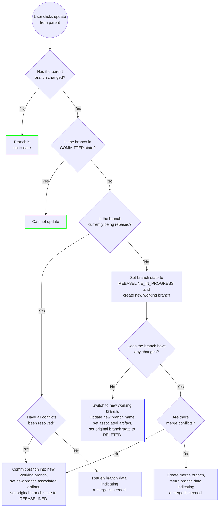
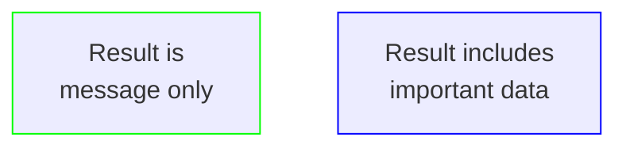

### Update From Parent:

```mermaid
    flowchart TD
        clickUpdate((User clicks update\nfrom parent))
        checkParentChanges{Has the parent\nbranch changed?}
        branchUpToDate[Branch is\nup to date]:::green
        canNotUpdate[Can not update]:::green
        isBranchCommitted{Is the branch in\nCOMMITTED state?}
        isBranchBeingRebased{Is the branch\ncurrently being rebased?}
        setToRebaseAndCreateBranch[Set branch state to\nREBASELINE_IN_PROGRESS and\ncreate new working branch]
        doesBranchHaveChanges{Does the branch have\nany changes?}
        switchToNewWorkingBranch[Switch to new working branch.\nUpdate new branch name,\nset associated artifact,\nset original branch state to DELETED.]:::blue
        checkMergeConflicts{Are there\nmerge conflicts?}
        commitBranchIntoNewWorking[Commit branch into new working branch,\nset new branch associated artifact,\nset original branch state to REBASELINED.]:::blue
        createMergeBranch[Create merge branch,\nreturn branch data indicating\na merge is needed.]:::blue
        areConflictsResolved{Have all conflicts\nbeen resolved?}
        needsMerge[Retuen branch data indicating\na merge is needed.]:::blue

        clickUpdate-->checkParentChanges
        checkParentChanges-- No -->branchUpToDate
        checkParentChanges-- Yes -->isBranchCommitted
        isBranchCommitted-- Yes -->canNotUpdate
        isBranchCommitted-- No -->isBranchBeingRebased
        isBranchBeingRebased-- Yes -->areConflictsResolved
        isBranchBeingRebased-- No -->setToRebaseAndCreateBranch
        setToRebaseAndCreateBranch-->doesBranchHaveChanges
        doesBranchHaveChanges-- No -->switchToNewWorkingBranch
        doesBranchHaveChanges-- Yes -->checkMergeConflicts
        checkMergeConflicts-- No -->commitBranchIntoNewWorking
        checkMergeConflicts-- Yes -->createMergeBranch
        areConflictsResolved-- Yes -->commitBranchIntoNewWorking
        areConflictsResolved-- No -->needsMerge

        classDef green stroke:#0f0
        classDef blue stroke:#00f
```

### Legend:

```mermaid
    flowchart TD
    id1[Result is\nmessage only]:::green
    id2[Result includes\nimportant data]:::blue

    classDef green stroke:#0f0
    classDef blue stroke:#00f
```
