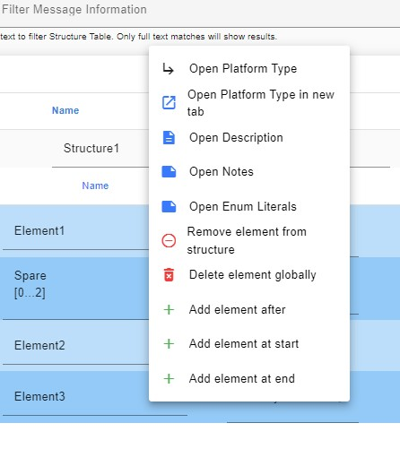
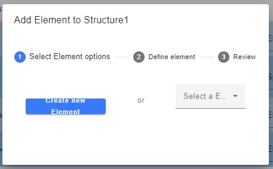
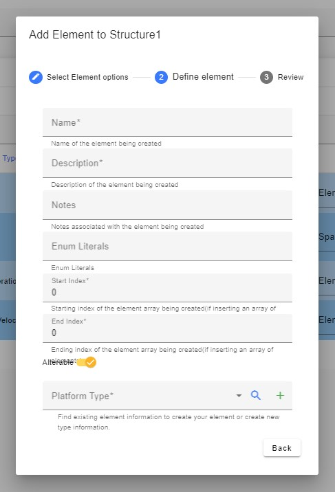
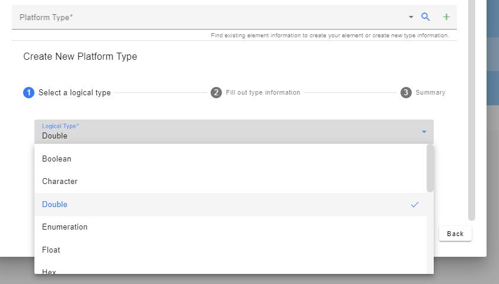
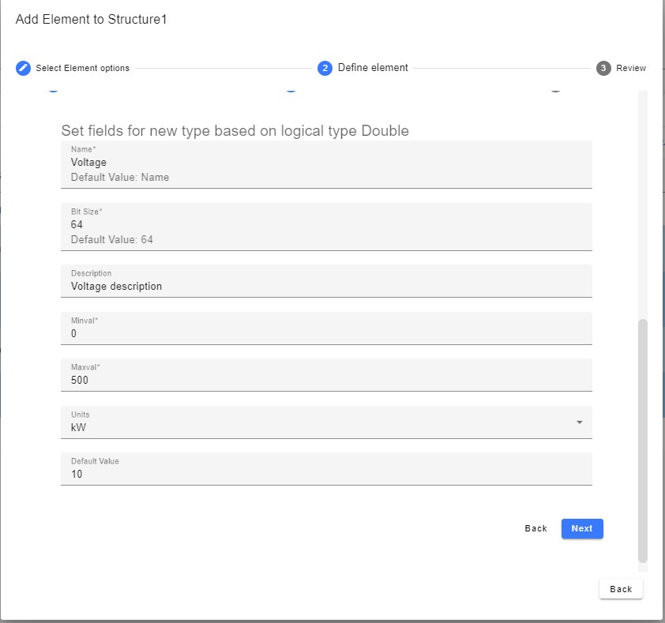
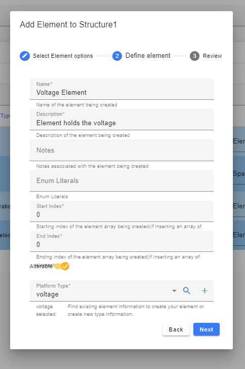
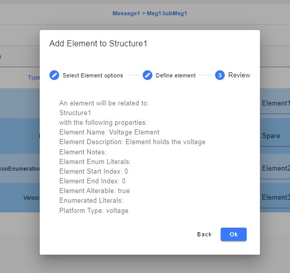
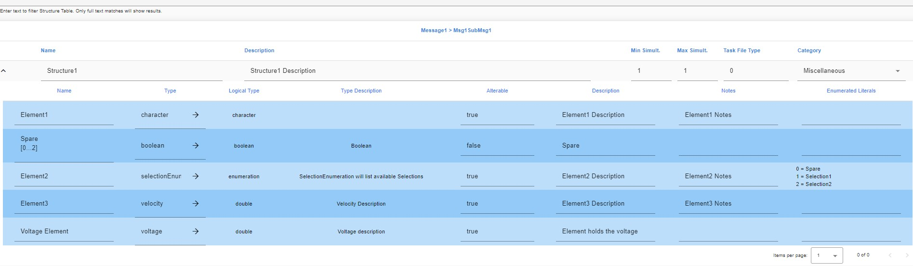

## Add an element to structure

1. Right click on any row on the structure to see the options for inserting an element
    > > 
2. After choosing the appropriate option you will see the following dialog:
    > > 
3. If the element to be inserted exists on another structure, choose the element from the drop-down menu on the right.
4. Otherwise, click on the “Create New Element” button to open up a dialog which will allow you to define a new element. Fields with an \* are required.
    > > 
5. If a type already exists that can be used, simply choose it in the Platform Type drop down. However, if a new type is needed, click on the green + sign on the right of the Platform Type field. Scroll down in the window to see the fields required to begin creating a Platform type.
    > > 
6. After selecting the appropriate logical type, click on the Next button and fill out the required fields. Then click next again.
    > > 
7. A summary of the new type will be shown. If it looks correct, click on the “OK” button.
8. The new Type will appear in the platform type field of the New Element form
    > > 
9. Verify all the fields look correct, then click “Next”.
10. A summary of the element to be created will appear:
    > > 
11. If it looks correct, click on “Ok”
12. The element will be added to the structure and the structure page will re-query.
    > > 
