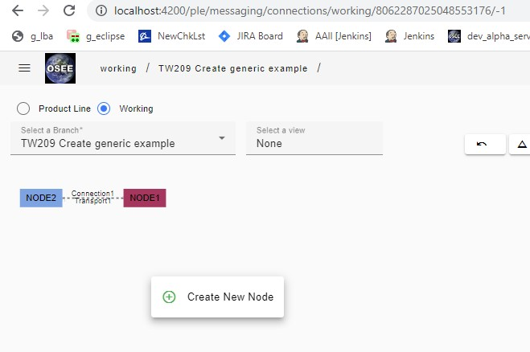
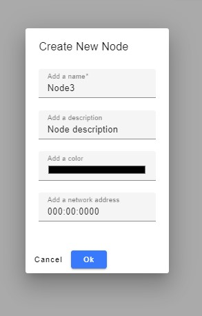
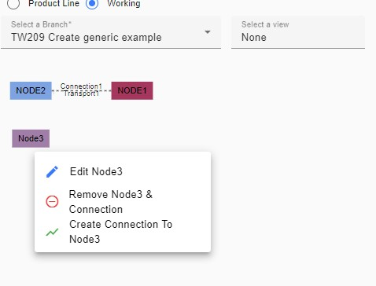
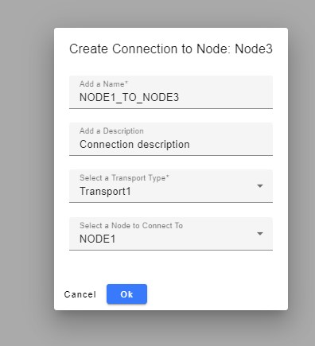

## Connections Page

This page can be used to view the various nodes and connections defined on the selected branch.

1. To add a node, right click on the empty space and click on “Create New Node”
   &nbsp;
    > 
2. Fill out required fields and click "Ok"
   &nbsp;
    > 
3. To create a connection between nodes, click on one of the nodes tied to the connection and click on “Create Connection To <node>”
   &nbsp;
    > 
4. Fill out required fields and click "Ok"
   &nbsp;
    > 
