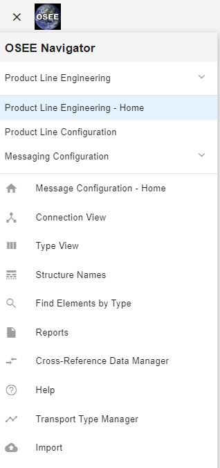
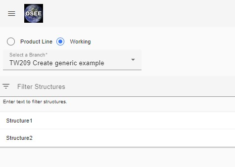
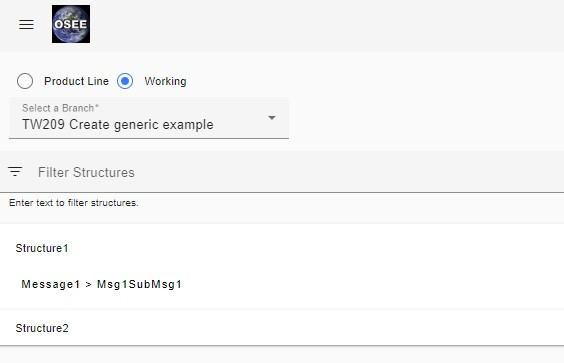
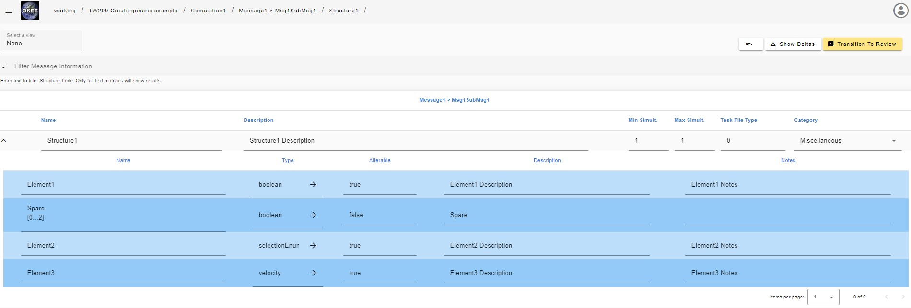
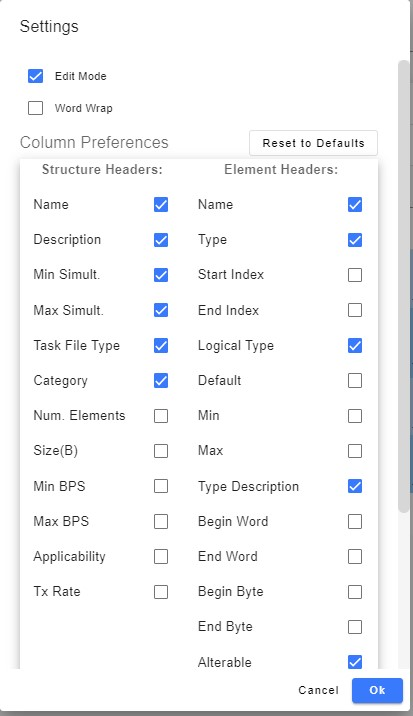
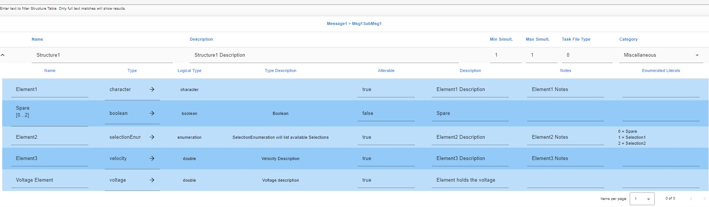
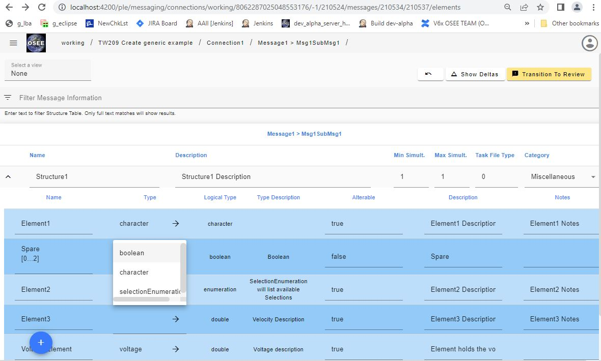

## How to edit a structure

1. Open up the “Structures Names“ page, found in the navigation pane which can be opened by clicking on the hamburger menu in the upper left corner of the page
    > > 
2. Choose the Working branch radio button and choose the working branch that will be used for the changes. The page will list all available structures to be modified. Use the Filter Field to find the structure to modify.
    > > 
3. Click on the name of the structure you wish to update and one or more locations will be expanded.
    > > 
4. Click (or right click) on the location to open up a page to edit the structure.
    > > 
5. In order to see other attributes of the elements, click on the avatar on the upper right side and click on the “Settings” option. There you will see a list of options:
    > > 
6. Most fields can be edited directly except for the Type, Logical Type, Type Description and Enum Literals (if the logical type = enumeration)
    > > 
7. Types can be changed by clicking on the “x” that appears when hovering over the Type field to clear the current value.
8. A drop down list will appear of available types, you can start typing the name of the desired type to filter the list. Once found, simply select the right type. The page will refresh and show the updated values of the type.
    > > 
9. In order to create a new type follow the instructions on “How To Create a Type”.
10. In order to add an element refer to [Add an Element](/ple/messaging/help/add_element) instructions
11. In order to remove an element from the structure, right-click on the element you wish to remove and simply click "Remove element from structure"

-   NOTE: Only choose "Delete element globally" if you intend to remove the element from every structure in the ICD. This option should be rarely used.
