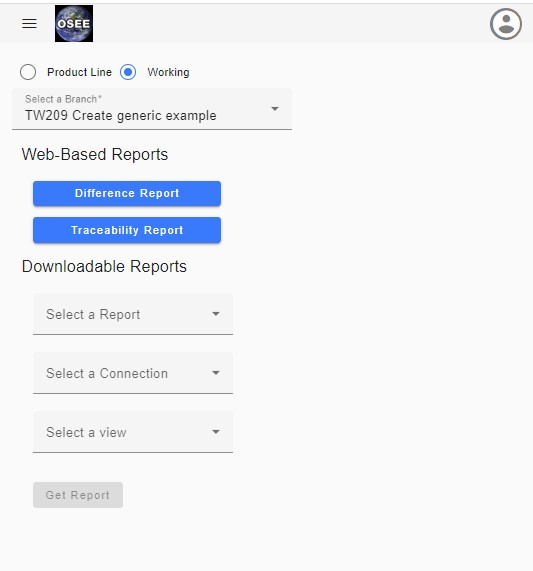

## Reports Page

The Reports page can be accessed on the main [Messaging web page](/ple/messaging) or using the OSEE Navigator which appears when the user clicks on the hamburger menu on the upper left side of webpage. The Reports page provides an interface to generate reports available per branch. Current available reports are:

-   Difference Report
    -   Shows the changes made by the selected working branch compared with the baseline
-   Traceability Report
    -   Shows links between ICD Artifacts and Requirement Artifacts
-   Downloadable Reports
    -   HSDN workbook version of the ICD per connection
    -   CSV files to be used an input into external tools

