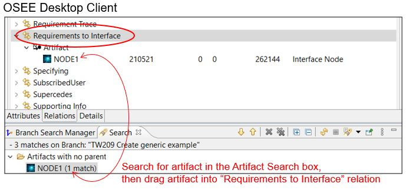
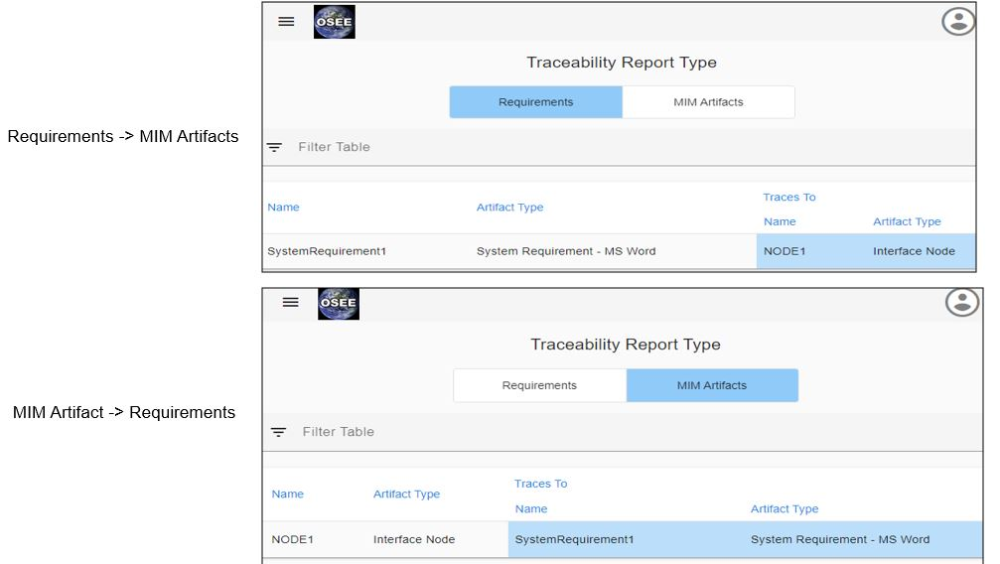

## Traceability between Requirements and MIM Artifacts

On the Reports page, users can run the Traceability Report to see relations between MIM Artifacts and Requirements Artifacts.

MIM Artifacts can be mapped to Requirements Artifact in OSEE as shown below.

1. Using the OSEE Desktop client users can drag a MIM Artifact to the "Requirements to Interface" relationship as shown below.
   &nbsp;
    > 
2. In order to validate the Traceability exists, run the Traceability report on the Reports page. The result should look like the following:
   &nbsp;
    > 
