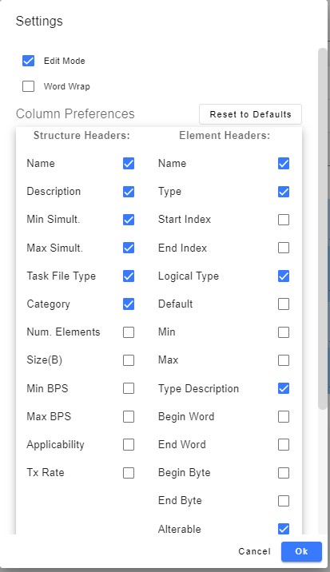

## Utilizing User Settings options

1. Click on your avatar on the upper right hand side of any page, then choose "Settings"
2. For the given page, you will see options for how to view data.
3. Following is the panel you will see while on the Structures page:
    > > 
4. Once the desired fields are selected, click "OK"
5. The page will then re-query showing/hiding the columns that were manipulated on the Settings page.
