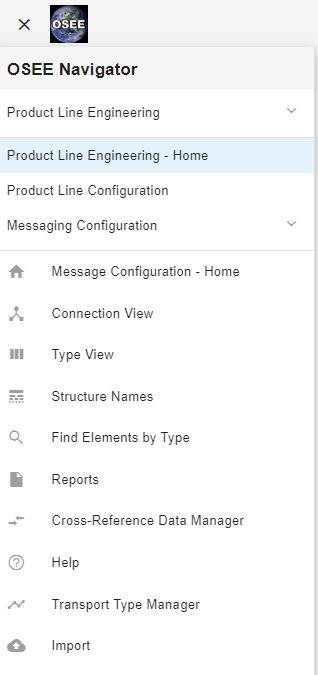

## Using the Cross Reference Manager

CrossReference definitions are composed of classified placeholders with their equivalent value. These definitions are used by the MIM tool when generating csv files

1. Open up the “Cross Reference Data Manager“ page, found in the navigation pane which can be opened by clicking on the hamburger menu in the upper left corner of the page
    > > 
1. Select the Working Branch for which you wish to modify the Cross Reference Data
1. To edit an existing row, right click on the row and select "Edit Cross Reference"
1. To delete an existing row, right click on the row and choose "Delete Cross Reference"
1. To add a row, click on the "+" button on the lower right hand side of the page. A "Create New Cross Reference" dialog will appear. Fill out the required fields.
