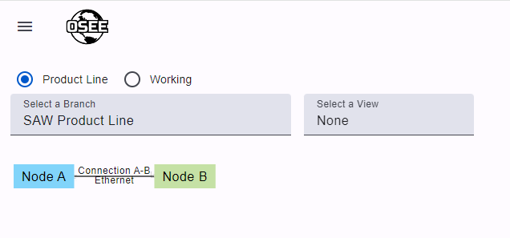
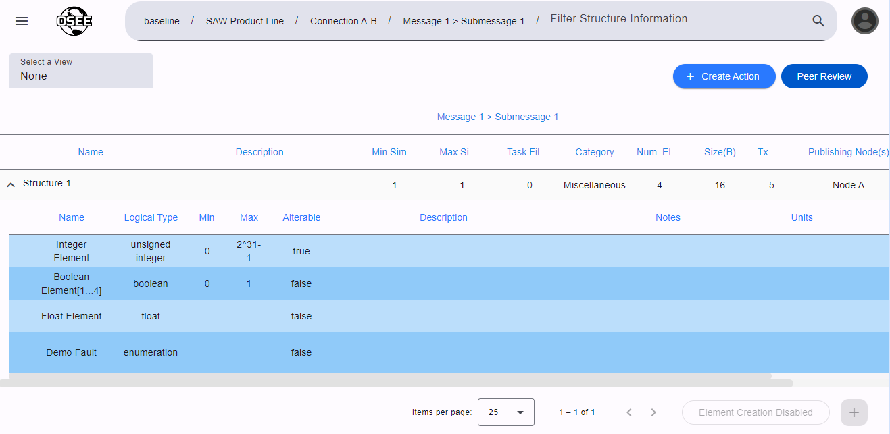

- On the `Saw Product Line` branch we have a [connection](/org.eclipse.osee/mim/datamodel#connection) consisting of two [nodes](/org.eclipse.osee/mim/datamodel#node)
  
- `Node A` and `Node B` can represent hardware or software components
- `Connection A-B` represents the set of data defined by [messages](/org.eclipse.osee/mim/datamodel#message), [submessages](/org.eclipse.osee/mim/datamodel#submessage), [structures](/org.eclipse.osee/mim/datamodel#structure), and [elements](/org.eclipse.osee/mim/datamodel#element), that are sent over the network between publisher and subscriber nodes.
- `Ethernet` represents the [type](/org.eclipse.osee/mim/datamodel#transport-type) of connection - example might be MUX, Fibre...etc
- Clicking on `Connection A-B` opens the Messages Page, showing the connection's messages in a table
  
- Clicking the drop down arrow to the left of the message name expands the table to show the submessages for the message. The message may also contain an autogenerated header, which has the yellow color. Autogenerated message headers can be enabled or disabled via the connection's [Transport Type](/org.eclipse.osee/mim/datamodel#transport-type)
  
- Clicking on the `Go To Message Details` button will open the Structures Page which will display the list of Structures that make up the SubMessages
  
- In this case `Submessage 1` contains one structure, `Structure 1`
- Clicking the drop down arrow to the left of the structure name expands the table to show the elements of the structure
- `Structure 1` is made up of 4 elements. Each element is assigned a [Platform Type](/org.eclipse.osee/mim/datamodel#platform-type) that defines the logical type, size in bytes, and value range of the element. The structure row itself has the total size of the structure, summing all of the elements. In this case, `Structure 1` is 16 bytes.
