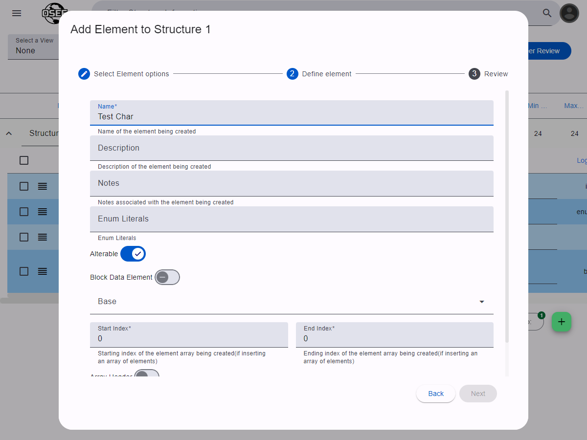

MIM provides many fields when creating elements, many of which allow for easier maintenance of arrays and report customization. This is an overview of what each field does and how they affect the [MIM ICD](/org.eclipse.osee/mim/pages/reports#mim-icd). Many fields are self-explanatory, so we will be going over the less obvious ones.

For a general overview of how to create an element, look [here](/org.eclipse.osee/mim/guides/create-icd#create-elements).

## Description

The description field allows for certain keywords to be entered that affect the description that is shown in the MIM ICD report.

- $index: If the element is an array, this keyword in the description will be replaced by the current array index in the report.
- $parentindex: If the element is under an [array header](#array-header), this keyword in the description will be replaced by the current array header index in the report.
- $parentname: If the element is under an [array header](#array-header), this keyword in the description will be replaced by the array header's name.

> These variables can also be used in the `Notes` field.

## Enum Literals

This field is used for non-enumeration elements that should have enum-like values. Examples of this could be

- Boolean elements where each boolean value has a more detailed meaning than true/false
- Numeric elements where specific values have specific meaning

## Block Data Element

A Block Data Element is an element that represents a single block of undefined data. Toggling `Block Data Element` to true causes the element's description to be placed in the ICD's `Type` field, with the cell spanning the rest of the sheet. This has been used to define large blocks of data with no defined details.

## Applicability

The applicability field defines which Views this element will be visible for. In the example above it is set to `Base` which is the default, making it visible for all Views.

## Start and End Index

The Start Index and End Index fields are used to define arrays. Defining elements as arrays allows for easier maintenance of repeating elements.

## Platform Type

If the desired platform type already exists, it can be searched for and selected. Otherwise, a new platform type can be created by clicking the `+` button in the field. Look [here](/org.eclipse.osee/mim/guides/create-icd#create-elements) for more details on creating platform types.

## Array Header

An array header is a header element that has child elements. Toggling `Array Header` to true will make more fields appear.

### Use Array Header Name in Reports

- True: the name of the array header will be used as part of the child element name. For example, a child element of `Test Char` called `Foo` would appear as:
  - Test Char 1 Foo
  - Test Char 2 Foo
- False: the name of the array header will not be used as part of the child element name. In this case, more fields are displayed to control the index delimiters.

### Array Index Order

This controls the order of the parent array index and child element index.

- Outer, Inner: The indices would be shown in the order of parent, then child.
- Inner, Outer: The indices would be shown in the order of child, then parent.

### Array Index Delimiters

The delimiters allow more control over how the indices are separated. The default value is a space, and they can be changed to any desired character.

Live examples are shown next to these fields that show what the orders and delimiters will look like in the report.

### Array Elements

Clicking the `+` button here allows child elements of the array header to be created in-place.
