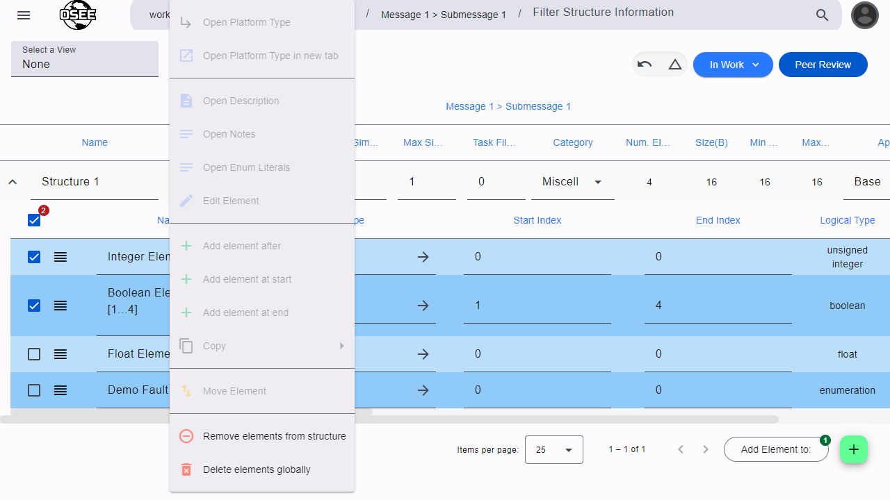

When editing ICDs, there are some features that can make maintaining ICDs easier.

> [Edit mode](/org.eclipse.osee/mim/guides/create-icd#enable-edit-mode) must be turned on to access these features.

## Selecting Multiple Elements

The element table has a multi-select feature that can be used to perform actions on multiple elements at once. Checking the boxes on the left side of an element's table row will cause the table to enter multi-select mode, which changes which actions are available on the context menu. The available context menu actions will now affect all of the currently checked elements in the table.

