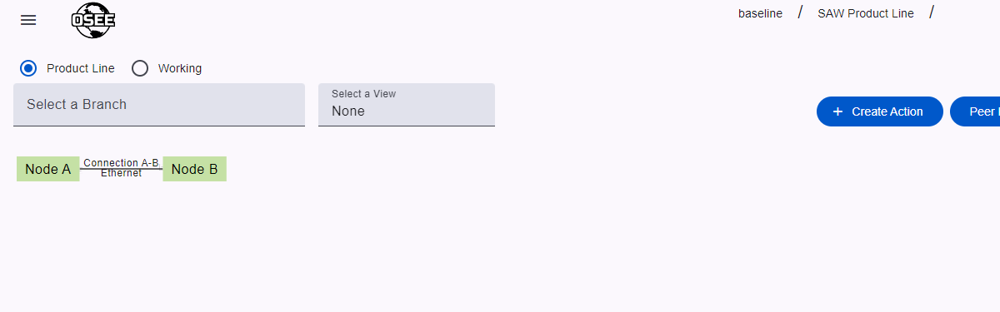
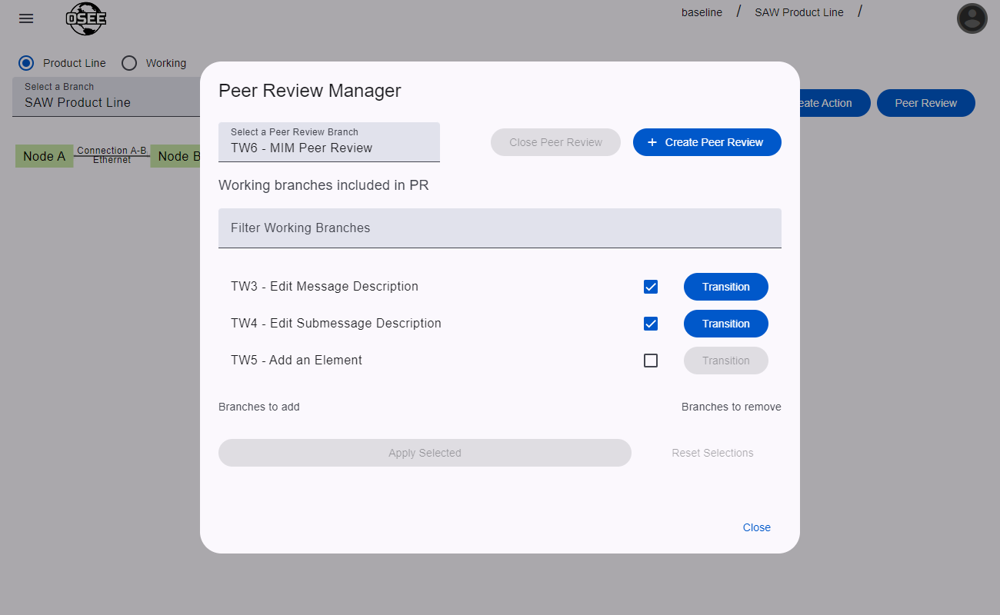

Peer reviews in MIM are used to combine changes from multiple branches into a single "Peer Review" branch. This is useful when a team's workflow requires changes to be made on individual branches, but need all of the changes on a single branch to review the complete ICD.

## Create a Peer Review Branch

To create the peer review branch, click the `Peer Review` button in the control cluster in the upper right side of the page to open the Peer Review Manager.

In the Peer Review Manager dialog, click the `Create Peer Review` button, populate the fields (this is very similar to [creating a normal working branch](/org.eclipse.osee/mim/guides/create-icd#create-an-action)), and click `Create Action`.

## Populate the Peer Review Branch

Now you will see a list of working branches that can be applied to the Peer Review branch. "Applying" in this case means taking all of the changes from the selected branches and putting them on the peer review branch. In this example, we are adding `TW2` and `TW3` to our peer review branch.

Once those branches are applied, the "Branches to add" list will clear meaning the application is complete.

Now, if we uncheck `TW3` to remove it from the PR, and check `TW4` to add it, we will see that reflected in the "Branches to add" and "Branches to remove" lists.

Applying these new selections will remove the changes from `TW3` and apply the changes from `TW4`. Now the peer review branch contains the changes from `TW2` and `TW4`.

## Additional Notes

- If additional changes are made to branches that have already been applied, those changes will not automatically apply to the peer review branch. You will need to go to the Peer Review Manager, uncheck the branches with the new changes, apply, re-check the branches with changes, and re-apply.
