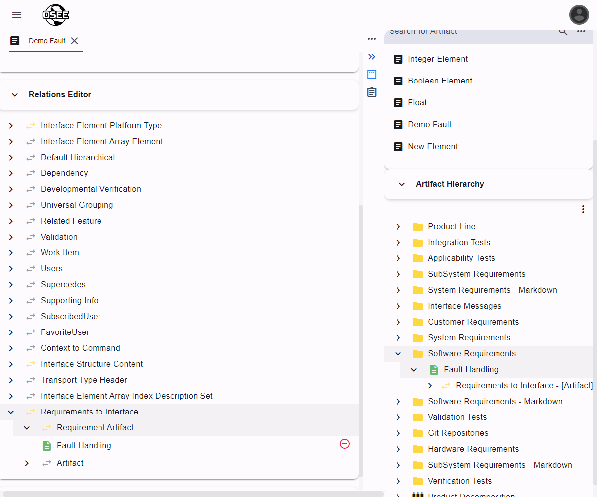

OSEE provides traceability between MIM artifacts and requirements. This makes it easy to view which MIM requirements

## What Is Traceability?

Traceability in OSEE is the chain of relations between artifacts, allowing for full tracing of artifacts across the engineering lifecycle. Requirements, code, test scripts, MIM artifacts, etc., can all be related, making it simple to view what is affected by changes to any part of the system.

In MIM, artifacts can be related to requirements, and vice versa, providing a view of which MIM artifacts are affected when requirements change.

## Relating MIM Artifacts to Requirements

1. Navigate to the Artifact Explorer via either the Product Line Engineering home page or the side navigation menu.
   
2. Select your working branch, or create one if needed.
3. Locate the MIM artifact you would like to trace to via the hierarchy or artifact search, and click to open in a tab.
4. Expand the Relations Editor panel in the artifact tab, and locate and expand the `Requirements to Interface` relation.
5. Locate the requirement you would like to trace to in the hierarchy.
6. Drag and drop the requirement into the `Requirement Artifact` relation in the relation tree. In this example, we related the `Fault Handling` software requirement to the `Demo Fault` MIM Element.
   

## Traceability Report

On the [Reports Page](/org.eclipse.osee/mim/pages/reports), there is documentation about MIM's [Traceability Report](/org.eclipse.osee/mim/pages/reports#traceability-report). This report shows the traceability between MIM artifacts and requirements in both directions, as well as which MIM artifacts and requirements are missing traceability.
