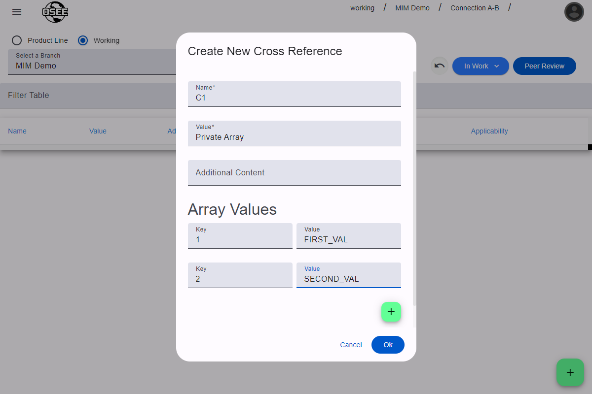

Cross-References in MIM are used to prevent classified or proprietary data from appearing in reports.

To use cross-references, create a new cross-reference with the name `C#`, where the `#` is any number. Then use that same `C#` name as the name of a MIM artifact.

> The [MIM ICD report] will not do cross-reference lookups and will display `C#`. Install-specific reports may use the cross-reference values. Ask your administrator about which reports use cross-reference values.

## Create a Cross-Reference

To create a cross-reference, you must be in [edit mode](/org.eclipse.osee/mim/guides/create-icd#enable-edit-mode).

Click the green `+` button in the bottom left corner of the page, and a dialog will appear.

The fields available when creating a cross-reference are as follows:

| Name               | Description                                                                                                                           |
| ------------------ | ------------------------------------------------------------------------------------------------------------------------------------- |
| Name               | The name should follow the `C#` pattern, where `#` is any number                                                                      |
| Value              | The value is the private value that the cross-reference is masking                                                                    |
| Additional Content | This field may hold any extra information that could be used in install-specific reports                                              |
| Array Values       | Cross-references can be used to create private enumeration sets. The Key is the ordinal and the value is the name of the enumeration. |
