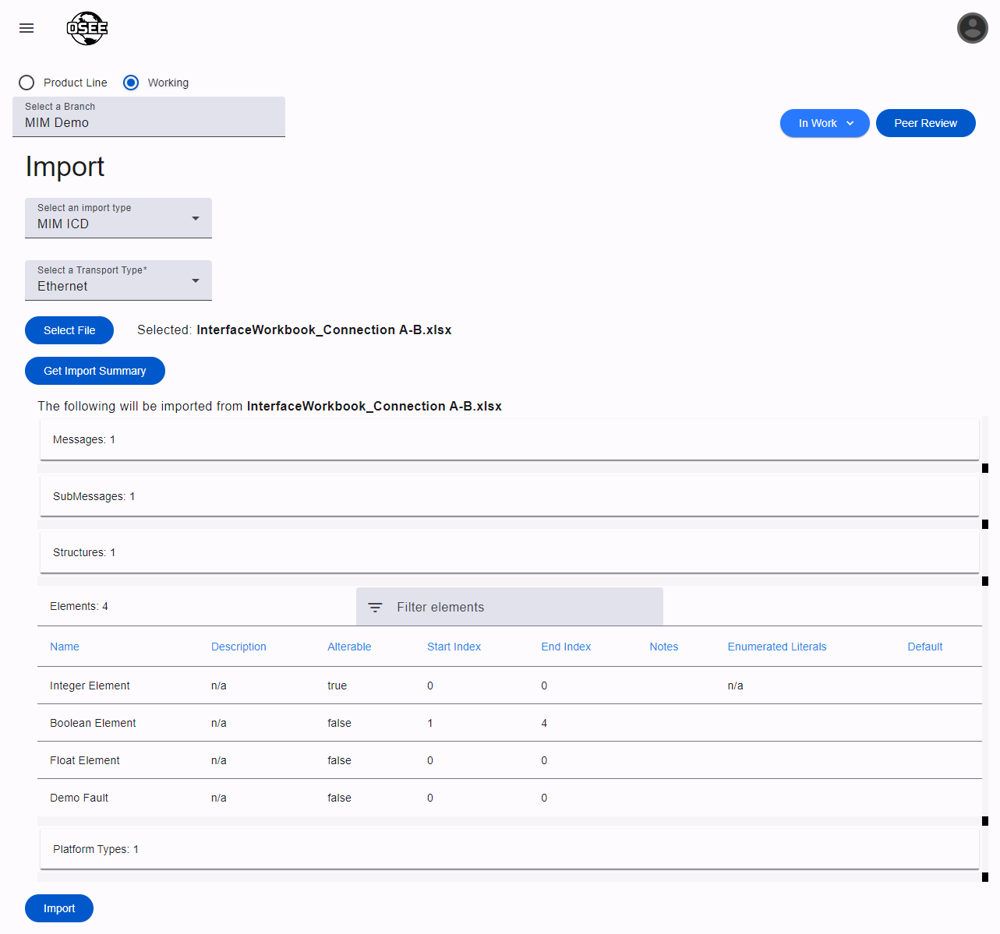

**_This page is only available to MIM Administrators_**

MIM provides the ability to import data into the tool. There is a built-in import available that supports importing MIM ICDs that were exported from MIM.

## MIM ICD Import

The MIM ICD import option is available on all MIM installations. It is used to import ICDs that have been exported from MIM ([see reports for details](/org.eclipse.osee/mim/pages/reports#mim-icd)).

You will need to select a Transport Type ([create one](/org.eclipse.osee/mim/pages/transport-types) if one does not exist on the selected branch), and then select the ICD to import.

Clicking `Get Import Summary` will upload the file, and the server will process it and return a summary of what will be imported. Tables will be shown for each artifact type, and they can be expanded and filtered.

If the summary looks correct, click `Import` at the bottom of the page to perform the final import into the branch. You will get a status message confirming that the import was successful.

## Install-Specific Imports

There may be install-specific imports available. Please refer to your install-specific documentation, or contact your OSEE administrator for more information.
