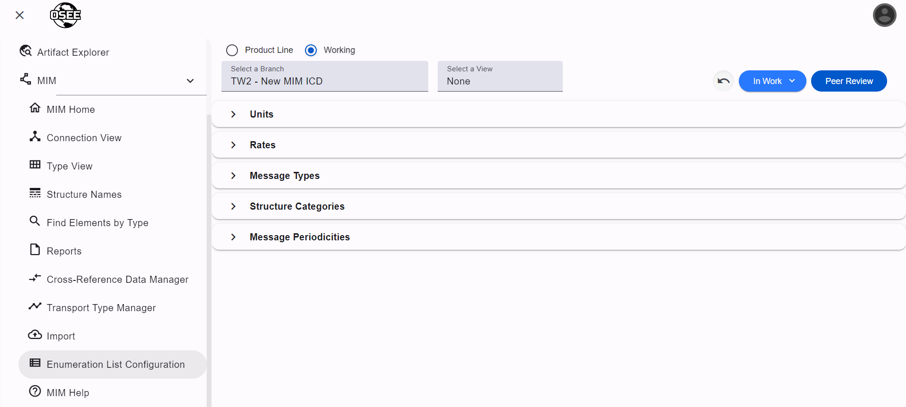

**_This page is only available to MIM Administrators_**

The List Configuration page is used to create the various artifacts that populate certain dropdowns throughout MIM.

## Units

Units are used when creating Platform Types. They have 2 fields:

1. Name - The name of the unit that will show in the Elements table and in most exports
2. Measurement - A description of what the unit represents. For example, the measurement for `seconds` would be `time`

## Rates

Rates are used when creating Messages to define the rate at which the message is transmitted.

## Message Types

Message Types are used to both categorize messages and trigger certain functionality. For example, when exporting to an Excel workbook, messages with the "Connection" type will be excluded from the Message and Submessage Summary.

Recommended Message Types:

1. Operational
2. Connection

## Structure Categories

Structures have a field called Structure Category that is used to, well, categorize structures. If your structures do not need categories, we would suggest creating a single category and use it on all of your structures, since it is a required field.

## Message Periodicities

Message Periodicities are used when creating Messages to define how messages are sent.

Recommended Message Periodicities:

1. Periodic
2. Aperiodic
