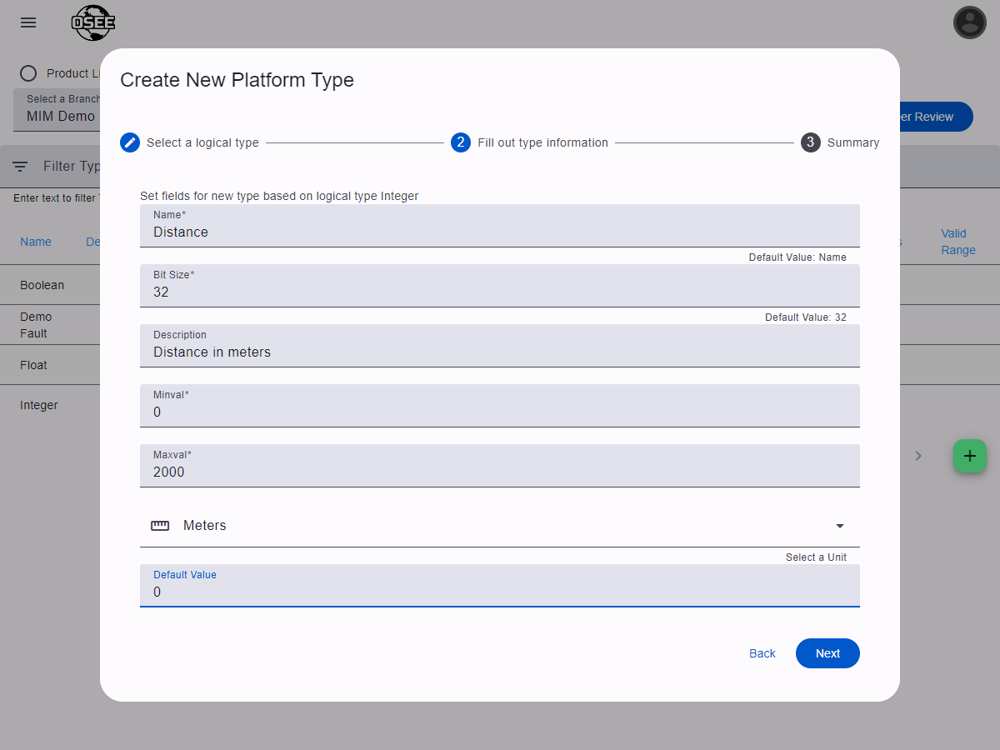
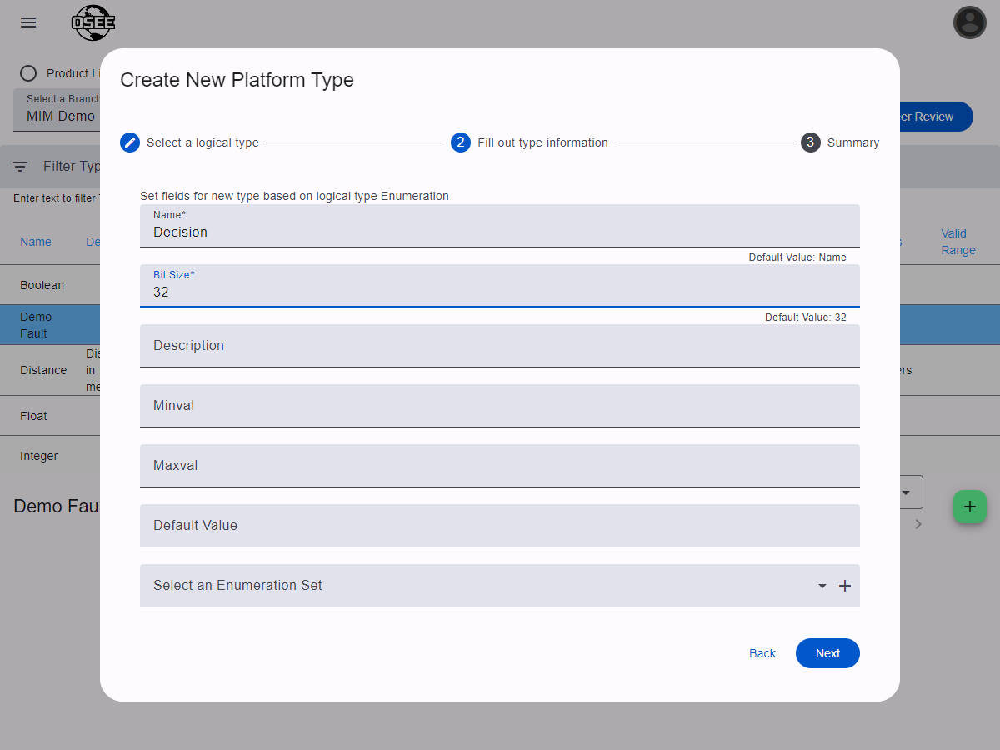
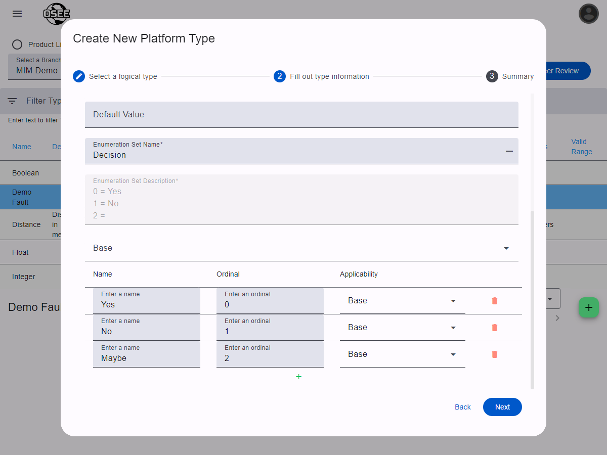

The Platform Types page is used to create, edit, and search for [Platform Types](/org.eclipse.osee/mim/datamodel#platform-type).

## Creating a Platform Type

To create a platform type:

1. [Enable Edit Mode](/org.eclipse.osee/mim/guides/create-icd#enable-edit-mode)
2. Click the green `+` button in the footer of the table
3. Select a logical type. For this example, we are choosing to create an Integer.

   

4. Click `Next` and populate the fields on the following page

   

   Some notable fields:

   - `Bit Size`: The size in bits that elements with this platform type will be. A recommended default value is displayed below the field.
   - `Minval`: The minimum value in the range of possible values for this type.
   - `Maxval`: The maximum value in the range of possible values for this type. These units are created on the [List Configuration Page](/org.eclipse.osee/mim/pages/list-config).
   - `Units`: The unit that this type represents. In this example, we are choosing Meters for our Distance type.
   - `Default Value` The default value for this type.

     

5. Click `Next` to review, and then `Ok` to create the platform type.

## Enumerations

Creating Enumeration platform types follows the same process, with some additional fields to populate. Follow the steps above until you get to step 4, selecting `Enumeration` as the logical type on step 3.

> For Enumerations, the `Minval` and `Maxval` likely do not need to be populated unkess your install-specific reports use those fields.

There will be a new field at the bottom of the dialog labeled `Select an Enumeration Set`. Almost all of the time, except in very special cases, you will want to create a new Enumeration Set here. Click the `+` button in that field to begin creating a new [Enumeration Set](/org.eclipse.osee/mim/datamodel#enumeration-set).

Clicking the `+` will make some new fields visible

- `Enumeration Set Name`: This is usually the same as the platform type name, but can be whatever you'd like.
- `Enumeration Set Description`: This field is disabled and will be automatically populated based on the set's enumerations.
- `Applicability`: As with most artifacts, the applicability can be set on the enum set for product lining purposes. Here it is set to "Base".

Below these fields, there is a table with a `+` below it. Click the `+` to create an [Enumeration](/org.eclipse.osee/mim/datamodel#enumeration) for the set. Add as many as needed, then click `Next` to review, and then `Ok` to create the platform type.

<!-- ## Editing Platform Types -->
