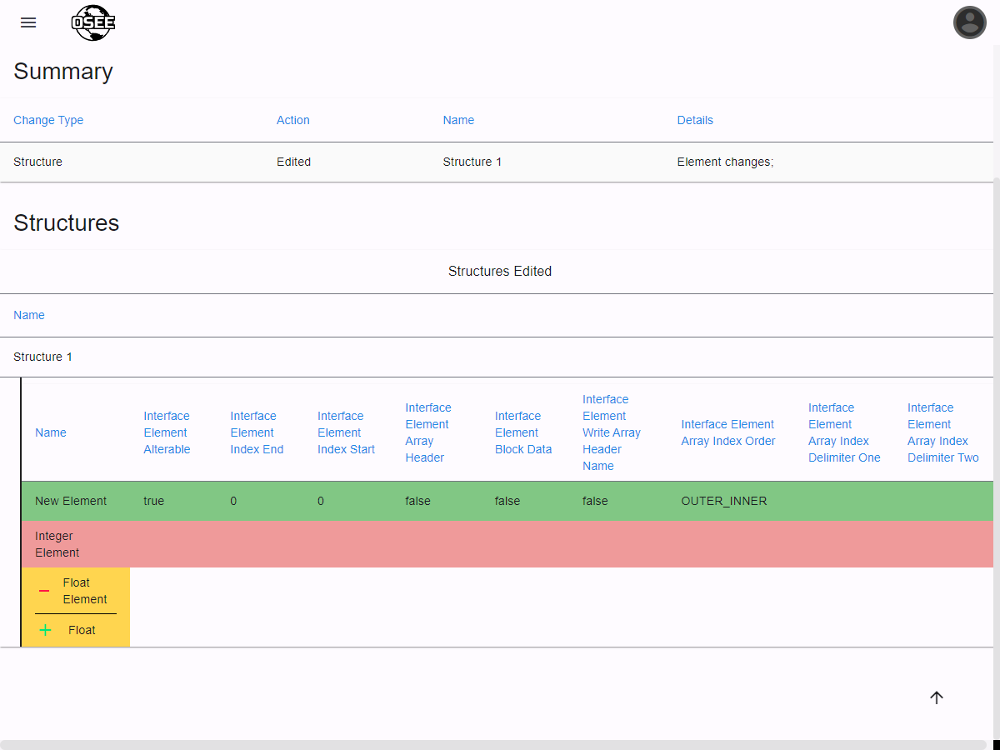
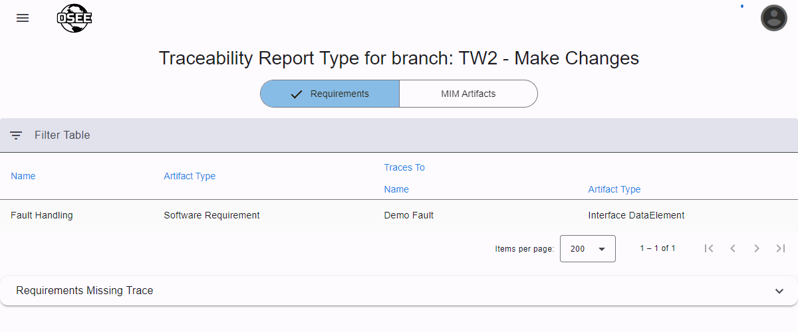
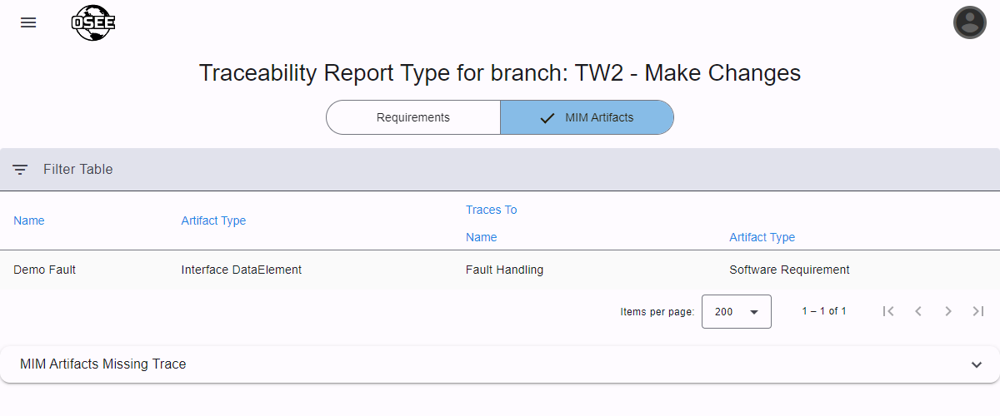
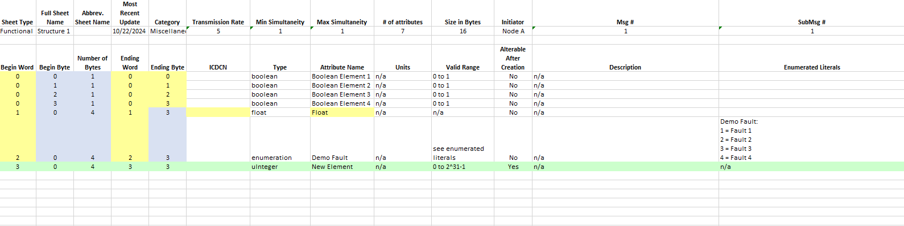

The reports page provides access to multiple types of reports that are generated from MIM data. There are web-based reports that display in the browser, and downloadable reports that produce files of various types.

## Web-Based Reports

MIM provides web-based reports that are available to view in the tool itself:

### Difference Report

- _Only available on working branches_
- The difference report shows all changes made to MIM artifacts, including additions, deletions, edits, and relation changes.
- In the report shown here, there was an element added (green), an element deleted (red), and an element's name was edited (yellow).
- Changes are put into separate tables based on the artifact type and the type of change.
  

### Validate Connection Impact

- _Only available on working branches_
- This report shows which connections have been affected by the changes made on the selected branch.
- This is useful when you want to ensure that only certain connections have been affected by the changes on the selected branch.

### Traceability Report

The traceability report shows the traceability between MIM artifacts and requirements. There are two views:

#### Requirements

- This view lists all of the requirements that have traceability to a MIM artifact, and which artifacts they are traced to.
- There is an expandable table that shows all of the requirements that are not traced to any MIM artifact.
  

#### MIM Artifacts

- This view lists all of the MIM artifacts that have traceability to a requirement, and which requirements they are traced to.
- There is an expandable table that shows all of the MIM artifacts that are not traced to a requirement.
  

## Downloadable Reports

MIM provides downloadable reports that will generate file(s) based on the selected report type and paramaters. By default, MIM has the following downloadable reports:

### MIM ICD

- This report requires the user to select a connection, and optionally select a view if generating for a specific configuration.
- The MIM ICD is an Excel workbook containing sheets that detail the connection's (ICD's) messages, submessages, structures, elements, etc.
- Differences can be shown in the workbook by checking "Show differences in report". This will color all of the cells in the workbook that contain changes from the selected branch. The color scheme is similar to the web-based difference report. A change history sheet will also be added which lists all of the commits that caused the changes.
- Before the ICD can be generated, the connection must be validated, or validation can be bypassed by checking the "Bypass connection validation" box.
  - Connection validation checks that specific criteria are met that can cause an ICD to be invalid, such as byte alignment, duplicate structure names, or missing important values.

Here is an example of what a structure sheet in the report looks like when showing differences. These changes are the same as what are shown in the [difference report](#difference-report) above.

### Install-Specific Reports

Additional reports may be available on your specific installation. Please see your organization-specific documentation or contact an administrator for help.
