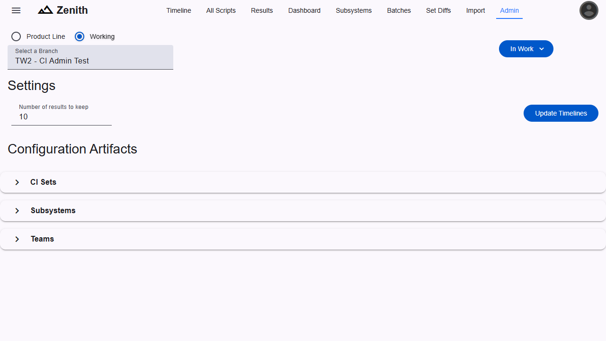

Zenith can be configured via the Admin page, accessible from the navigation links at the top of the screen, or the side navigation menu. The user must have the `CI Admin` role to access the page.

### Settings

#### Number of results to keep

This setting specifies the number of results that are kept for each script, for each CI Set. When test results are imported, if the number of results for a specific test script on a CI Set goes over this value, the least recent results (based on test execution time) will be deleted.

#### Update Timelines

This button will force the charts on the Timeline page to update for all active CI Sets. This is useful when new results are imported but the timeline update has not been run yet. Generally, the timeline will be updated when the test result purge is run. The frequency of that is determined by the admin of the OSEE instance.

### Configuration Artifacts

#### CI Sets

CI Sets can be created, edited, and deleted here. When the table is expanded and a working branch is selected, there is a button to add a new CI Set.

#### Subsystems

Subsystems are assigned to test scripts for categorization.

#### Teams

Teams are assigned to test script to provide visibility into which team owns the script, and so the point of contact assigned to the team can be notified of test failures.
