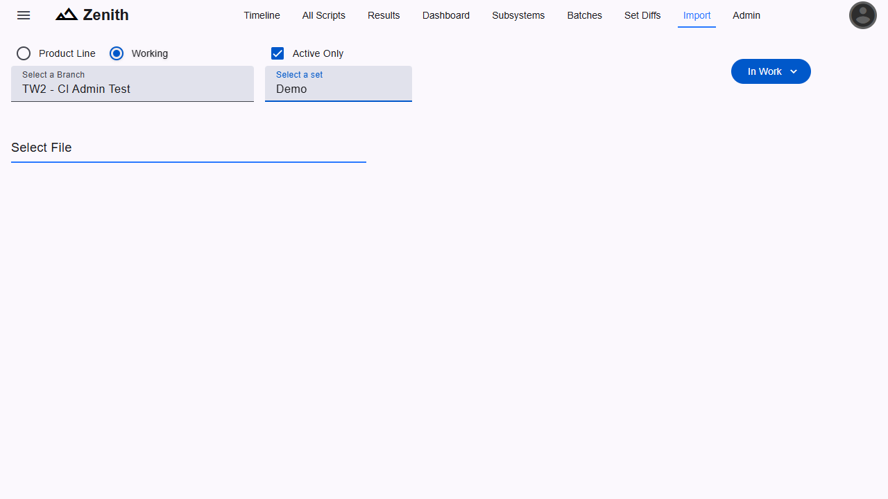

Test results can be imported from the Import page (found in navigation links at the top of the page and the navigation sidebar), or via the REST API if importing results from a CI pipeline. The user must have the `CI Admin` role to access the page. If the links to the page are not visible, the user does not have the required role.

### Import Page

On the Import page, select the branch and CI Set that the results should be uploaded to, and use the file select control to select files to upload. Both individual .tmo files and zipped folders of .tmo files can be uploaded. If the zipped folder contains a `runId.txt` file, a Batch will be created that can be viewed on the Batches page.

### Importing Via REST API

Test results can be imported via the REST API with the following request URLs. Each one requires a valid authentication header and form data with the key being `file` and the value being the file(s) to upload.

#### Individual File

`POST <server url>/script/tmo/<branchId>/import/file/<ciSetId>`

#### Zipped Folder

`POST <server url>/script/tmo/<branchId>/import/batch/<ciSetId>`
